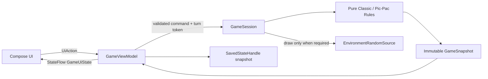
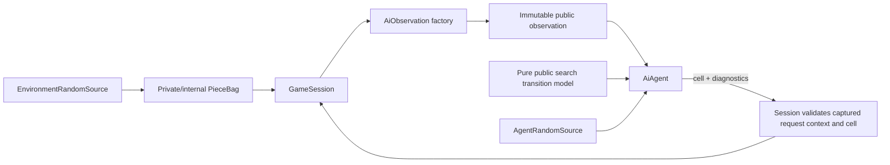

# Pic-Pac-Poe Remaster: Architecture, AI, and Implementation Plan

Audit date: 2026-08-26  
Repository: `com.thevaguebox.probabilistictictactoe`  
Audited branch/commit: `refinement` / `63b6749`  
Scope: audit and plan only; no production implementation is included in this document.

> Snapshot warning: this repository currently has three contradictory states. `HEAD` is the published-era implementation. The Git index stages deletion of the legacy activities/MCTS and addition of an unfinished replacement. The working tree adds further unstaged manifest/layout/style edits. The index alone and the complete working tree are both non-buildable. Findings below name the relevant snapshot explicitly.

## A. Executive Assessment

Pic-Pac-Poe has a good product premise but is not currently a safe release or portfolio baseline.

The committed app (`HEAD`) is a small Activity-owned XML game that offers Pic-Pac local and Pic-Pac versus a heuristic computer. Its ordinary nonterminal draws after turn one are count-weighted, but the first piece is forced to X, the held piece remains counted in the bag, terminal pieces are never depleted, state is lost on recreation, and a human can move during the delayed computer turn. There is no Classic mode. Its `MCTSAgent.kt` is unused and models ordinary alternating-X/O Tic-Tac-Toe, not this game.

The staged replacement points in the right general direction by introducing player identities, bag counts, an engine class, and explicit decision/chance node names. It is nevertheless a prototype, not a salvageable rules or AI foundation:

- it chooses a cell before drawing the symbol;
- it still maps X wins to Player 1 and O wins to Player 2;
- it gives the agent the live `GameEngine` and its draw capability;
- `ChanceMCTS` cannot terminate its first rollout and spins indefinitely;
- reset leaves old symbols visible over an empty logical board;
- no Classic or local mode remains;
- it does not link resources and cannot build.

An unmerged `mcts_dev` / `dql_rlbaby` commit contains an “RL” experiment. It trains deterministic alternating X/O, ignores stochastic draws and bag probabilities, treats the opposite symbol as the opponent, and does not implement a valid Bellman action target. It should be documented as an abandoned experiment and replaced, not merged.

How much survives:

- **Preserve:** application ID/namespace; the product concept; the committed visual history as reference; the eight win lines; the correct count-based probability formula; the absence of Internet permission/cloud dependencies; a few assets only after provenance review.
- **Rewrite:** rule/state ownership, turn phases, both AI implementations, Activity state, mode navigation, tests, lifecycle handling, UI semantics, and release setup.
- **Remove later, not now:** dead MCTS/RL prototypes, empty placeholder classes, template tests/theme, stale Firebase config, generated release bundles, personal IDE state, orphan assets, and obsolete XML after Compose parity.

This is not a case for enterprise Clean Architecture. It is a case for a tiny, rigorous stochastic-game core, a capability-safe AI boundary, one Android presentation layer, and one development-only experiment harness.

The exact game is small enough to solve. An exhaustive audit-time enumeration under the canonical rules found:

| Canonical graph item | Reachable | D4 board-symmetry orbits |
|---|---:|---:|
| Post-draw decision states | 21,314 | 3,022 |
| Pre-draw chance states, including the initial state | 11,065 | 1,572 |
| Terminal states | 6,648 | 956 |
| Total phase-aware states | **39,027** | **5,550** |
| Legal decision/action pairs | **78,286** | **10,238 action orbits** |

There are 99,600 unique graph edges. A naive, non-memoized history tree unfolds to about 120.9 million phase nodes, which explains why careless recursion can be slow while exact memoized search is tiny. These numbers should be regenerated by a checked-in enumerator before becoming README claims.

Enumeration assumptions: fixed initial starter, first piece randomly drawn, held piece removed before the decision, players alternate after nonterminal placement, mover wins, and search stops immediately on the first line/full board. Swapping the absolute starter is isomorphic under player-to-move normalization rather than a larger strategic state space.

## B. Current Repository Map

### B.1 Snapshot map

| Snapshot | Entry point | Rules owner | Production computer | Status |
|---|---|---|---|---|
| `HEAD` (`63b6749`) | `LandingActivity` -> legacy `MainActivity` | Activity fields/methods | `MainActivity.computerMove()` heuristic | Historically functional; semantically wrong in several places |
| Git index | Old activities deleted; new `.ui.MainActivity` added; old manifest/layout still indexed | Staged `GameEngine` | Staged `ChanceMCTS` | Cannot compile/launch if committed as indexed |
| Full working tree | `.ui.MainActivity` directly launched | Staged `GameEngine` | Staged `ChanceMCTS` | AAPT failure and nonterminating AI |
| `mcts_dev` / `dql_rlbaby` (`04f3b2e`) | Legacy activities plus RL buttons | Activity + Android `TrainingManager` | Heuristic or linear-weight “RL” | Unmerged, underdeveloped, invalid for canonical rules |

### B.2 Important code and configuration

| File/component | Current responsibility and evidence | Disposition |
|---|---|---|
| `settings.gradle.kts:22-23` | One `:app` module | Preserve, then add only justified pure-Kotlin/tool modules |
| `app/build.gradle.kts:8-16` | Namespace/application ID, SDK 35/24/35, version 4/1.2.1 | Preserve ID; upgrade toolchain/SDK; verify Play version code |
| `gradle/libs.versions.toml:2-13` | AGP 8.8.0, Kotlin 2.0.0, old AndroidX/Lottie/BOM versions | Update as an atomic compatibility matrix |
| `app/src/main/AndroidManifest.xml` | Working tree launches `.ui.MainActivity`; no permissions | Reconcile immediately; keep no Internet permission |
| `HEAD:.../LandingActivity.kt:9-30` | Two-button local/computer mode selector using string extras | Rewrite as typed three-mode navigation |
| `HEAD:.../MainActivity.kt:20-378` | UI, board, bag, rules, audio, delayed work, and heuristic AI in one Activity | Rewrite; preserve only behavior/visual references |
| `HEAD:.../MCTSAgent.kt:5-97` | Unused ordinary Tic-Tac-Toe MCTS | Dead; replace from first principles |
| `core/engine/GameEngine.kt:19-165` | Staged mutable state, draw probability, transition, winner/payoff, reflection copy | Rewrite; concepts only, not implementation |
| `core/ai/ChanceMCTS.kt:10-202` | Staged production search | Discard/reimplement; currently nonterminating and semantically wrong |
| `core/ai/EMVEvaluator.kt:20-110` | Unused MCTS wrapper with reflection | Dead; remove until a valid solver exists |
| `core/model/{Move,Outcome,Player}.kt`, `core/engine/{RNG,Rules}.kt`, `core/ai/RolloutPolicy.kt` | Empty four-line placeholders | Replace with real types or remove |
| `ui/MainActivity.kt:22-289` | Working-tree XML controller and raw coroutine scope | Rewrite into thin Activity + ViewModel/Compose |
| `ui/theme/*.kt` | Unused default Compose template | Rewrite for actual product theme |
| `activity_main.xml`, `view_*.xml`, `overlay_chance.xml` | Working-tree visual prototype | Reference only; replace after Compose parity |
| `dialog_winner.xml` | Lottie result dialog with symbol-owner default text | Selectively retain visual idea; rewrite semantics |
| `mcts_dev:FeatureExtractor.kt`, `QLearningAgent.kt`, `TrainingManager.kt` | Branch-only linear approximation/on-device training experiment | Archive as failed experiment; do not merge |
| `ExampleUnitTest.kt`, `ExampleInstrumentedTest.kt` | `2 + 2` and package-name template assertions | Replace completely |
| `app/google-services.json` | Tracked Firebase client config; no plugin/dependency consumes it | Confirm unused, remove later, restrict/decommission project |
| `app/release/*` | Tracked 15.0 MiB AAB and generated metadata/profile outputs | Remove from source history/worktree by an approved cleanup |
| `Privacy Policy.docx` | Binary policy with `[Your App Name]` placeholder and personal metadata | Replace with reviewed Markdown/hosted HTML |
| `.idea/*` | Eleven tracked local IDE files, including a physical-device identifier | Untrack local state; optionally whitelist intentional shared config |

### B.3 Build verification performed during this audit

`./gradlew.bat :app:assembleDebug :app:testDebugUnitTest` reached Android resource linking and failed. The errors are concrete, not inferred:

- `bg_cell.xml:6,13,17`: missing `cell_pressed`, `cell_idle`, `cell_border`;
- `bg_turn_dot.xml:4`: missing `x_color`;
- `ui/MainActivity.kt:213,219,275,277`: also references missing `x_color` / `o_color`;
- Gradle warns that `package=` in working `AndroidManifest.xml:2` is ignored because namespace belongs in Gradle.

No test executed because resource linking failed.

## C. Current Game-Rule Audit

| Rule/behavior | Committed `HEAD` | Staged/working replacement | Canonical verdict |
|---|---|---|---|
| First turn | `currentSymbol = "X"` at legacy `MainActivity.kt:36-40`; reset repeats it at `370-375` | Starts 5/5, but the player chooses a cell before `sampleSymbol()` (`ui/MainActivity.kt:108-116`) | First piece must be a genuine 5/5 draw before cell choice |
| Draw order | Current symbol is visible before legacy move | Human samples only after tapping a cell; AI picks at `:138` and samples at `:139` | Determine actor -> draw/remove -> reveal -> choose cell |
| Without replacement | After nonterminal placement, decrements and samples using exact remaining-count weight (`HEAD MainActivity.kt:178-193`) | Sampling does not remove; arbitrary caller-supplied `applyMove` removes later (`GameEngine.kt:82-115`) | Removal occurs once, atomically at draw; placement must consume the held piece only |
| Held-piece accounting | Held piece remains in displayed counts until placement | No held-piece state; it exists in an Activity closure | During placement, `placed + held + hidden = 5` per symbol |
| Terminal depletion | Win/draw returns before `switchTurn`; last piece is not deducted (`HEAD MainActivity.kt:155-168`) | Ideal UI calls `applyMove`, but API can skip/reuse/deplete exhausted pieces | Terminal piece was already removed at draw; full-board draw leaves one hidden piece |
| Turn switch | Normal path toggles; race-prone callbacks can act for wrong actor | Engine always switches, even after a win (`GameEngine.kt:107-113`) | Switch exactly once after a nonterminal placement; terminal state retains winner/last mover |
| Winner identity | Legacy message uses the actor who just moved (`HEAD MainActivity.kt:155-160`) | `winner()` returns P1 for X and P2 for O (`GameEngine.kt:125-138`) | The mover wins with either symbol; symbol never identifies player |
| Win detection | Covers eight lines at `HEAD MainActivity.kt:323-333` | Covers eight lines but assigns wrong player | Inspect lines through the last cell; store mover, placed symbol, and all completed lines |
| Draw detection | Board full after win check, but counters are wrong | Winner-or-no-legal-move at `GameEngine.kt:121-123` | Full board with no new line; exactly one unused bag piece |
| Terminal enforcement | UI returns, but delayed callbacks/input remain possible | `applyMove` accepts post-terminal placements | Terminal states reject every future draw/place command |
| Invalid states | Mutable Activity fields can diverge | Public mutable `Array`, arbitrary counts/turn/symbol, negative counts possible | Constructors/factories and phase types minimize invalid states |
| Reset | Clears legacy views/state, but fixed-X and pending callback persist | Replaces engine only; old TextViews are never cleared (`ui/MainActivity.kt:195-200,261-265`) | New revision, new first draw, all jobs cancelled, UI wholly projected from state |
| Computer turn | 500 ms `Handler` delay leaves board active (`HEAD MainActivity.kt:171-174`) | Board is visually disabled, but raw coroutine is uncancelled and stale results can hit reset state | ViewModel-owned job + turn/revision token + engine legality check |
| Rapid taps | Any empty cell is accepted regardless of actor (`HEAD MainActivity.kt:134-175`) | Overlay incidentally intercepts taps; no domain draw/reveal gate | Input accepted only in `AwaitingPlacement`, once, for current revision/actor |
| Lifecycle | Rotation/process recreation silently resets all fields | Fresh engine on every `onCreate`; held piece exists only in closure | ViewModel survives configuration; restorable snapshot includes held piece; no RNG/seed exposed |
| Modes | Pic-Pac local + heuristic AI; no Classic | Always Pic-Pac AI; no mode selection | Classic Local, Pic-Pac Local, Pic-Pac AI |
| UI terminology | Mostly “Player 1/2” plus symbol | Explicitly says “Player X/O” at `ui/MainActivity.kt:210-220` | Players and pieces must be visually/semantically separate |
| Probabilities | Depletion bars; exact counts were commented out | Two bars show percent of original stock, not next-draw odds | Show exact hidden counts and clearly labelled next-draw percentages |

### C.1 Legacy race sequence

The legacy race is deterministic:

1. Human places; Activity switches to Player 2 and posts AI for 500 ms.
2. Human taps another empty button; `handleMove()` accepts it as Player 2.
3. State switches back to Player 1 while the old callback remains queued.
4. Old callback makes a move for Player 1 and may schedule another AI callback after switching again.
5. Restart or recreation does not cancel any of these callbacks.

The result can be a human playing the AI piece, the AI playing both sides, or a stale callback mutating a reset/detached screen.

The legacy layout also declares board cells that are not the runtime cells: `initializeBoard()` removes every `GridLayout` child and creates anonymous Buttons in code (`HEAD MainActivity.kt:104-131`). This defeats normal view restoration/semantics and makes the XML board definition dead at runtime. The win sound creates a `MediaPlayer` at `:345-347` and never releases it.

### C.2 Staged engine invariant failures

`GameState.board` is a public mutable array (`GameEngine.kt:19-25`), so callers can alter cells without counts/turn changing. `applyMove()` verifies only index, vacancy, and X/O (`:99-103`); it does not verify availability, held symbol, phase, terminal status, or current actor. `reset(seed)` constructs an unused local RNG (`:52-59`). `copy()` reflects into private state (`:157-162`) and does not copy RNG state. This is a set of mutable utilities, not a trustworthy game engine.

## D. Current AI Audit

### D.1 Committed production heuristic

The actual published computer is `HEAD MainActivity.computerMove()` (`:214-264`), not MCTS. It:

1. takes an immediate win with the currently held symbol;
2. calls the opposite symbol the “opponent symbol” and tries to block it;
3. prefers center, then shuffled corners, then shuffled edges.

Only step 1 is semantically sound. The next player may draw either symbol, so the threat is a probability-weighted set of X and O winning placements, not “the opposite of my symbol.” Counts and next-draw probabilities do not influence the heuristic. Its random fallback builds a coordinate from two independently selected empty cells (`:262-264`), which could compose an occupied coordinate, though the preceding center/corner/edge partition currently makes that fallback effectively unreachable.

The heuristic has no intentional future knowledge. However, game randomness and heuristic tie-breaking both use process-global default randomness, so search/tie-breaking can perturb later environment draws. There is no architectural information boundary.

### D.2 Legacy `MCTSAgent.kt`: dead and invalid

Repository search finds no construction or call of `MCTSAgent`; production never uses it. Independently of dead-code status, it models the wrong game:

- node state is only board/move/statistics (`:7-14`);
- rollouts alternate X/O deterministically (`:20-28`);
- expansion treats `currentPlayer: Char` as symbol ownership (`:32-39`);
- reward hard-codes X = +1 and O = -1 (`:45-52`);
- every level maximizes the same X-relative UCB;
- terminal children can be expanded further;
- UCB divides by zero for unvisited children (`:41-43`);
- randomness is unseeded and there is no budget/cancellation.

It should be deleted after preservation of the audit/history, not “fixed” incrementally.

### D.3 Staged `ChanceMCTS`: used, but nonterminating

Working `ui/MainActivity` constructs `ChanceMCTS(engine)` at `:51-53` and calls `bestMove(engine.state)` at `:138`. Its explicit `DecisionNode` and `ChanceNode` names do not make it correct.

The first production AI turn never completes:

- first simulation expands the root and calls `rollout(rootState)` (`ChanceMCTS.kt:90-95`);
- every rollout iteration calls `engine.copy()` and applies one move (`:161-185`);
- `GameEngine.copy()` always clones the unchanged live production root (`GameEngine.kt:157-162`);
- after the first human move, every iteration therefore has exactly the human mark plus one simulated mark;
- such a board can neither have three equal marks nor become full, so the loop at `ChanceMCTS.kt:164` is infinite.

Even if that loop were patched, the algorithm remains invalid:

- topology is `choose cell -> chance symbol`; the current symbol must already be known;
- deeper transitions also clone live root rather than `node.state` (`ChanceMCTS.kt:124-125`);
- every decision node maximizes root reward, so the opponent cooperates (`:146-154`);
- winner/payoff inherits X=P1/O=P2;
- backpropagation is invoked at leaf, chance return, and decision return, so ancestors are updated multiple times per simulation (`:82-133,194-200`);
- unvisited actions are not forced to be explored;
- no transpositions, symmetry, time limit, cancellation, or reliable diagnostics exist;
- the agent retains the live engine, whose public `sampleSymbol()` can consume production randomness.

`EWVEvaluator` is unused. It integrates over an unknown current symbol before a chosen cell (`EMVEvaluator.kt:52-71`), starts MCTS from the opponent’s perspective, then takes the minimum of opponent-relative values without negating them (`:73-88`). It also uses reflection while calling its rehydration “Hack-free” (`:95-108`). Remove it with the prototype.

### D.4 Branch-only RL experiment

Commit `04f3b2e` adds `FeatureExtractor`, `QLearningAgent`, and Android `TrainingManager`:

- training begins with fixed X and deterministically flips X/O (`TrainingManager.kt:19-30,47-52`);
- remaining counts are decremented but never used to sample a piece;
- features encode “my symbol” and “opponent symbol” (`FeatureExtractor.kt:5-10,38-40`);
- the feature extractor misses several two-in-a-row arrangements, especially middle gaps;
- `nextQ` is a single after-board feature score, not a max over legal next actions (`TrainingManager.kt:61-65`);
- the `-1` reward branch cannot meaningfully train the previous losing actor in the current loop;
- one shared three-weight linear model omits board identity, bag distribution, held piece, actor perspective, and legal action identity;
- `Math.random()` / `.random()` are unseeded;
- 10,000 episodes run in an unowned Android coroutine and post 10,000 progress updates to the main thread;
- weights are serialized as a list string in `SharedPreferences`.

This is neither tabular Q-learning nor a valid approximation of canonical Pic-Pac-Poe. The branch should not be merged. Its only reusable idea is that RL can be an explicit Lab mode.

### D.5 Fairness verdict

No implementation was found intentionally peeking at a pre-generated queue, and no future queue currently exists. That is not enough. The staged agent is passed the capability-bearing live engine. Both lineages couple agent randomness and environment randomness through `Random.Default`. Fairness is therefore a convention, not a property.

The replacement must ensure the agent’s only game input is an immutable `AiObservation`; game RNG, bag implementation, live session, environment seed, and any future draw capability must be absent from its type graph and constructor graph.

## E. Canonical Game Specification

### E.1 Shared definitions

- Board cells are indexed 0-8 in row-major order.
- `Symbol` is X or O. A symbol is a piece, not a player.
- `Player` is Player 1 or Player 2. Player identity is independent of symbol.
- A legal placement targets exactly one empty cell.
- The eight winning lines are the three rows, three columns, and two diagonals.
- A game stops immediately after the first placement that completes one or more lines.
- A terminal game accepts no action.

### E.2 Classic

- Board starts empty.
- Player 1 uses X and Player 2 uses O for the whole game.
- The selected starting-player policy is applied.
- On a legal placement, place the active player’s fixed symbol.
- If that placement completes a line, that player wins; otherwise draw on a full board; otherwise switch player.
- There is no bag, held piece, chance node, or probability display.

### E.3 Pic-Pac

Initial state:

- board empty;
- hidden bag X = 5, O = 5;
- selected starting player active;
- phase `AwaitingDraw`.

Draw transition:

1. Let `R = remainingX + remainingO`.
2. Draw X with `remainingX / R`, otherwise O with `remainingO / R`.
3. Decrement the drawn symbol immediately.
4. Enter `AwaitingPlacement(activePlayer, heldSymbol)`.
5. Reveal only the public result; do not expose RNG/seed/state.

Placement transition:

1. Reject wrong phase, stale turn token, terminal state, nonempty cell, or out-of-range cell.
2. Place exactly the held symbol at that cell.
3. If the placement completes a line, finish with `Win(mover, heldSymbol, winningLines)`; do not switch actor.
4. Else if the board is full, finish with `Draw`; one hidden piece remains.
5. Else switch active player, clear held symbol, enter `AwaitingDraw`, and obtain the next draw through the session/environment boundary.

### E.4 Required invariants

For every reachable Pic-Pac state:

- `0 <= remainingX, remainingO <= 5`;
- board length is 9 and every cell is Empty/X/O;
- no nonterminal state already contains a completed line;
- in `AwaitingDraw`, `#Xboard + remainingX = 5` and `#Oboard + remainingO = 5`;
- in `AwaitingPlacement(h)`, `#Xboard + remainingX + I[h=X] = 5` and likewise for O;
- in `AwaitingPlacement` with `n` occupied cells, hidden bag total is `9 - n`;
- the held symbol is placed once and only once;
- active player changes only after a nonterminal placement;
- winner is the last mover, regardless of X/O;
- a full-board draw has nine placed pieces and one hidden piece;
- board occupancy equals placement-history length;
- environment draw count equals placements plus one only while a piece is held;
- current state is a complete source of truth; UI widgets hold no competing rules state.

Production randomness is sampled on demand. There is no pre-generated sequence. For deterministic tests/replays, a separate test environment may inject a seed or scripted draws; that capability is never included in production `AiObservation`.

### E.5 Exact reference fixtures

With a fixed first player and a genuinely random first draw, exact optimal negamax Expectiminimax produces these audit-time values for the actor at an empty-board post-draw decision:

- center: `5/21 ~= 0.238095`;
- any corner or edge: `11/126 ~= 0.087302`;
- the values are identical whether the first held piece is X or O by symbol symmetry.

These are high-value independent oracle tests. The checked-in solver and an independently written exhaustive enumerator must agree before publishing them.

## F. Proposed Target Architecture

### F.1 Module decision

Do not remain a single Android module. A small pure-Kotlin `:game-core` pays for itself through exhaustive JVM tests, deterministic replay, search reuse, and Android-free benchmarking. The fairness requirement also justifies a separate small `:game-ai` module so concrete agents cannot access `internal` bag/RNG implementation types. Add one non-APK `:game-tools` module only when the tournament/RL work begins.

Target shipping modules:

1. `:app` - Android, Compose, ViewModels, navigation, platform audio/haptics, production wiring.
2. `:game-core` - pure Kotlin immutable model, Classic/Pic-Pac rules, session transitions, observation creation, public deterministic search model; internal bag/environment RNG details.
3. `:game-ai` - pure Kotlin agents; depends on safe `:game-core` observation/search APIs, never on a live session capability.

Development-only:

4. `:game-tools` - JVM command-line tournaments, exact enumeration, RL training, artifact generation. It is not packaged in the APK/AAB.

Do not create repository/data/domain/use-case/DI modules. Do not add Hilt. Constructor wiring in `AppContainer`/factory functions is enough.

### F.2 Android control/data flow



The UI animates state changes; it does not decide rules. A reveal animation starts only after the engine has drawn and removed the piece. Animation completion changes presentation gating, not the draw result.

### F.3 Fair AI flow



There is deliberately no edge from agent to `GameSession`, `PieceBag`, environment RNG, environment seed, or future draws. The agent may use its own independently seeded RNG for tie-breaking/sampling and a pure simulator that requires explicit chance outcomes.

### F.4 Lifecycle/concurrency flow

- `GameViewModel` owns one AI `Job` in `viewModelScope`.
- Every game/reset has a monotonically increasing `GameRevision`; every held piece has a `TurnToken`.
- The ViewModel captures `(GameRevision, TurnToken)` beside each AI request and pairs that context with the eventual `AiDecision`; it is deliberately not part of `AiObservation` or agent-owned diagnostics. The session rejects stale context and revalidates legality.
- Reset/navigation cancels the job and increments the revision.
- Search checks cooperative cancellation at bounded intervals.
- Configuration change retains ViewModel/state/job.
- Process recreation restores the public snapshot, including held piece and phase, but not a production RNG seed. Future draws use a fresh private source; no hidden future had been promised.

## G. Target Domain Model

Names are illustrative but deliberately small.

| Type | Responsibility |
|---|---|
| `Symbol { X, O }` | Typed piece; no player semantics |
| `Player { ONE, TWO }` | Actor identity; `other()` helper |
| `Cell` | Validated 0-8 value class; row/column helpers |
| `Board` | Immutable packed ternary value (0..19,682); `get`, `place`, `emptyCells`, stable equality/hash |
| `WinningLine` / `WinDetector` | Shared eight-line detection; can restrict checks to last cell |
| `RemainingPieces(x, o)` | Validated nonnegative counts and exact probabilities |
| `MoveRecord(ply, player, symbol, cell)` | Public replay/audit history; optional in compact AI observation |
| `GameOutcome` | `Win(player, symbol, lines)` or `Draw` |
| `ClassicState` | Board, active player, status/history; fixed symbol derived from player |
| `PicPacPhase` | `AwaitingDraw` or `AwaitingPlacement(heldSymbol, turnToken)` |
| `PicPacState` | Board, active player, remaining pieces, phase, status/history/revision |
| `GameSnapshot` | Read-only UI/restoration projection over either ruleset |
| `GameCommand` | Small command set such as `Place(cell, token)` and `Restart`; draw remains session-controlled |
| `GameResult` | Accepted snapshot/events or typed rejection; no partial mutation |
| `GameSession` | Owns current immutable state and private environment draw capability; serializes commands |
| `RandomSource` | `nextInt(untilExclusive)` capability; production and test implementations |
| `AiObservation` | Safe post-draw decision projection only |

Recommended representation:

```kotlin
sealed interface PicPacPhase {
    data object AwaitingDraw : PicPacPhase
    data class AwaitingPlacement(
        val held: Symbol,
        val turnToken: TurnToken,
    ) : PicPacPhase
}

data class AiObservation(
    val board: Board,
    val actor: Player,
    val agentPlayer: Player,
    val held: Symbol,
    val remainingAfterDraw: RemainingPieces,
    val legalCells: List<Cell>,
)
```

Important design choices:

- Use a packed immutable board rather than an exposed `Array`; it makes equality, memoization, copying, symmetry, and serialization cheap.
- Keep `ClassicRules` and `PicPacRules` explicit. A single highly generic rules framework would obscure the one meaningful variation.
- Share only `Board`/win detection/outcomes where semantics truly match.
- Keep `PieceBag`/environment source private or `internal`; expose remaining counts as values, never the capability that draws.
- Do not place AI difficulty in game rules. Participant configuration belongs to session/setup.
- Do not model reveal animation as a game rule. Presentation can gate input until it acknowledges the already-completed draw.
- Do not use reflection, mutable singleton state, or nullable combinations such as “sometimes there is a held piece.” Phase types express it.

## H. AI Framework Design

```kotlin
fun interface AiAgent {
    suspend fun chooseMove(
        observation: AiObservation,
        limits: SearchLimits,
    ): AiDecision
}

data class SearchLimits(
    val nodeBudget: Int? = null,
    val deadlineNanos: Long? = null,
)

data class AiDecision(
    val cell: Cell,
    val diagnostics: AiDiagnostics = AiDiagnostics.None,
)
```

`AiDecision` intentionally contains no session token. The ViewModel owns the asynchronous request envelope and echoes its captured revision/token when submitting the returned cell, so agents neither manufacture nor reinterpret session authority.

Contract:

- all agents receive the exact same public observation;
- current held symbol is known; future symbols are chance events;
- returned cell must be in `legalCells`; the engine still validates it;
- no agent receives a mutable board, `GameSession`, `PieceBag`, environment `RandomSource`, seed, or future queue;
- search randomness is agent-owned and independent from environment randomness;
- deterministic node-budget runs + deterministic agent seed are reproducible;
- time-budget runs use a monotonic clock and cooperative cancellation;
- production maps agent exceptions/timeouts to an explicit safe fallback and diagnostic, while tournaments score invalid/timeout decisions as forfeits;
- every nontrivial agent reports nodes/simulations, cache hits, depth, elapsed time, and chosen value when meaningful.

Fairness enforcement:

1. `:game-ai` constructors and `AiAgent` methods accept observation/search services only.
2. `PieceBag` and production RNG adapter are `internal` to `:game-core`; no public getter exposes either.
3. A module/API architecture test forbids `GameSession`, bag, and environment RNG fields/constructor parameters in concrete agents.
4. A binary API snapshot asserts the exact fields exposed by `AiObservation`.
5. A spy-RNG test proves changing agent seed/simulation budget does not change environment draws under the same environment seed.
6. There is no production pre-generated draw sequence. Replay stores past results, not future ones.

## I. Individual AI Designs

### I.1 RandomAgent

- **State:** `AiObservation` only.
- **Algorithm:** uniformly select one `legalCells` entry using agent-owned RNG.
- **Complexity:** O(number of empty cells), O(1) extra memory, target p95 < 1 ms.
- **Strengths:** unbiased control/baseline; excellent legality/fairness test fixture.
- **Weaknesses:** no tactics.
- **Role:** benchmark baseline and AI Lab; optional “Chaos” mode, not a main difficulty.
- **Status:** production-safe implementation, normally not user-facing.

### I.2 HeuristicAgent

This agent must be player/tempo-relative rather than symbol-owner-relative.

For board `B`, define `W_s(B)` as the set of empty cells where placing symbol `s` immediately completes a line. Define `P_s(B)` as open same-symbol line potential and `F_s(B)` as fork potential (distinct future completion cells). With next-draw probability `p_s`, a tactical potential can be:

```text
H(B, remaining, actorToMove) =
  sum over s in {X,O} of p_s *
    [w1 * I(|W_s| > 0) + w2 * max(0, |W_s| - 1)
     + w3 * openTwo_s + w4 * openOne_s]
```

For each legal current action `a` with the known held symbol:

1. return a dominant score for an immediate win;
2. otherwise enumerate each possible next draw `t` with exact bag probability;
3. enumerate the opponent’s legal reply and assume it chooses the lowest root-relative result;
4. score a terminal opponent win as -1; otherwise evaluate the resulting board with the root actor to move next using `H` plus a small line-incidence/intersection term.

Conceptually:

```text
Q_easy(a) =
  +1, if a wins now
  sum_t p(t) * min_b [ -1 if opponent wins with (t,b)
                        else k * H(result, nextBag, rootToMove) ]
```

The calculation is tiny: at most 9 current actions * 2 draws * 8 replies * 8 lines. Tune weights only through deterministic tournaments. Easy should always take a direct win; for other states use a seeded top-band/epsilon policy (for example, 20-25% choice among the top three) rather than deliberately making absurd moves. It remains legal and fair.

- **Strengths:** instant, explainable, probability-aware, beatable.
- **Weaknesses:** short horizon and tuned weights; not an optimality claim.
- **Role/status:** user-facing Easy; production.

### I.3 ExpectiminimaxAgent

- **State:** packed board, actor, held symbol, remaining counts after draw; no RNG state/history.
- **Algorithm:** decision nodes for the known piece, exact chance nodes for future draws, adversarial player decisions, player-relative terminal utility.
- **Medium:** placement-depth-limited search (calibrate 3-5 plies), memoization within decision, heuristic leaves, optionally small seeded top-band variation.
- **Hard:** full terminal search with exact bag probabilities, transposition cache, stable deterministic tie-break; D4 symmetry only after correctness.
- **Complexity:** at most 21,314 reachable decision states / 99,600 graph edges for a global exact solve; packed cache below ~1 MiB, ordinary maps a few MiB.
- **Strengths:** correct stochastic model; exact/near-exact oracle; predictable.
- **Weaknesses:** implementation must get perspective, chance timing, and action remapping exactly right.
- **Role/status:** Medium and Hard; production primary.

### I.4 StochasticMctsAgent

- **State:** same fair observation and pure forward model.
- **Algorithm:** decision(current known symbol) -> action -> terminal or chance(next draw) -> opponent decision. Chance nodes sample exact bag probabilities; UCT exists only at decisions.
- **Value:** store local player-to-move values and negate on player switches, or consistently store root-relative values and minimize at opponent nodes.
- **Rollout:** cumulative immutable state, exact draws, terminal-on-placement, tactical/random legal policy.
- **Budgets:** deterministic simulation counts (100/1,000/10,000) for experiments; optional calibrated wall-clock budgets; cancellation per simulation.
- **Complexity:** O(simulations * <=9-ply horizon); memory O(expanded nodes).
- **Strengths:** educational comparison, anytime behavior, stochastic-search diagnostics.
- **Weaknesses:** variance and tuning; exact search should dominate this tiny solved game.
- **Role/status:** AI Lab/portfolio experiment, not a marketed production difficulty unless benchmarks overturn the expectation.

### I.5 ReinforcementLearningAgent

- **State:** normalized post-draw `(board, held symbol, remaining X/O after draw)`; player-to-move perspective.
- **Action:** empty cell.
- **Transition:** place known piece, terminal check, otherwise environment samples/depletes next piece and perspective changes.
- **Algorithm:** primary tabular negamax Q-learning; Monte Carlo control as an experimental comparator. No neural network.
- **Training:** deterministic JVM self-play, alternating starters, decaying epsilon, exact solver oracle evaluation, versioned policy artifact.
- **Inference:** local table lookup/tie-break only; no training/network/model download needed.
- **Complexity/storage:** 78,286 reachable state/action pairs (~313 KiB raw Float values); 10,238 D4 action orbits (~40 KiB raw Float values), plus keys/metadata.
- **Strengths:** legitimate compact RL experiment, measurable optimality gap, instant offline inference.
- **Weaknesses:** convergence/exploration and symmetry bugs; unlikely to beat exact solver.
- **Role/status:** required portfolio/AI Lab implementation, explicitly not a blocker for the first remastered Play release.

### I.6 Planned performance envelope

These are engineering budgets to validate on a declared reference device, not already measured claims:

| Agent | Work per early move | Memory target | Latency/coroutine policy |
|---|---:|---:|---|
| Random | <= 9 legal cells + one agent RNG draw | O(1) | p95 < 1 ms; common suspend API may return immediately |
| Heuristic | <= 9 * 2 * 8 = 144 opponent-reply combinations, each scanning 8 lines | < 100 KiB working set | p95 < 1 ms; compute dispatcher for API consistency |
| Medium Expectiminimax | depth 3 is <= ~2,016 naive leaves; depth 4 <= ~24,192 before memoization | configurable cache <= 2 MiB | p95 <= 25 ms; background + cancellation/node cap |
| Hard Expectiminimax | global worst graph 21,314 decision + 11,065 chance states / 99,600 edges | packed < 1 MiB; implementation cap <= 5 MiB | cold p95 <= 100 ms; warm p95 <= 10 ms, p99 <= 25 ms; background |
| MCTS Lab | selected 100/1k/10k simulations * <= 9 placements | measure; interactive cap initially <= 8 MiB | publish quality/latency curve; cancellable UX budget initially <= 250 ms |
| RL policy | state encode + table lookup over <= 9 actions | artifact + runtime < 1 MiB | p95 < 1 ms; entirely local |

If measurement misses a budget, first reduce allocations/use packed caches or adjust Medium/MCTS budget. Do not fake responsiveness by hiding main-thread work behind animation.

## J. Expectiminimax Deep Dive

### J.1 Correct node order

```text
MAX: AI has already drawn h
  -> choose legal cell and place h
     -> terminal utility, or
     -> CHANCE: opponent draws X/O from remaining bag
        -> MIN: opponent knows the drawn symbol
           -> choose legal cell
              -> terminal utility, or next CHANCE
```

The same solver is simpler and less error-prone in normalized negamax form: every decision node maximizes for its local actor, and switching actor negates value.

### J.2 Equations

Let `s = (B, h, rX, rO)` be a post-draw decision state from the current actor’s perspective. For legal cell `a`:

```text
Q(s,a) = +1                                  if placing h at a wins
         0                                   if it fills the board without a win
         -[rX/R * V(drawX(after(s,a)))
           + rO/R * V(drawO(after(s,a)))]    otherwise

V(s) = max over legal a of Q(s,a)
R = rX + rO
```

Zero-probability branches are omitted. `drawX` decrements `rX` before constructing the opponent’s decision state; likewise O. The minus sign changes perspective to the opponent. Absolute MAX/MIN produces the same answer if utility is always `+1 AI win, -1 AI loss, 0 draw`.

### J.3 Cache key and canonicalization

Minimum logical key:

```text
(base3Board, heldSymbol, activePlayer/perspective, remainingX, remainingO)
```

With a fixed initial 5/5 bag and valid state, counts are derivable from board + held symbol, and actor is derivable from occupancy/starter. Store and validate them anyway for clarity; the packed search key may omit redundant fields after tests prove equivalence.

D4 symmetry can canonicalize eight rotations/reflections and store the minimum board encoding. The selected action must be transformed back through the inverse mapping. Because exact search is already small, implement symmetry only after an unsymmetrized oracle suite; an action-remapping defect is more dangerous than a few MiB.

### J.4 Pruning and performance

Ordinary alpha-beta cannot be applied unchanged through a chance expectation because all probability mass contributes. A bounded chance node can maintain:

```text
partial = sum evaluated p_i * v_i
mass = 1 - sum evaluated p_i
lower = partial - mass
upper = partial + mass              // utility bounds are [-1,+1]
```

An ancestor cutoff is safe only when this interval can no longer change its choice (Star-style pruning). With only two chance outcomes and ~39k total states, memoization and move ordering are simpler and safer; bounded chance pruning is an optional measured optimization, not Phase 1 complexity.

Suggested Hard implementation:

- packed Int state keys;
- dense/sparse primitive value cache plus best-action bitmask;
- immediate terminal actions ordered first;
- cache shared for a rules version;
- cold solve on a background dispatcher; warm move is lookup;
- no main-thread work;
- acceptance target: warm p95 <= 10 ms and p99 <= 25 ms on the agreed baseline device; cold first decision p95 <= 100 ms; solver cache <= 5 MiB. Tighten after measurement.

The exact opening values in E.5, late-game hand fixtures, exhaustive graph counts, and symmetry equivalence form the solver’s acceptance oracle.

## K. RL Deep Dive

### K.1 Environment

Use the same pure Pic-Pac transition model as every other agent/benchmark. The training environment, not the learner, owns stochastic draws.

- **State:** packed board, held symbol, remaining counts after draw, normalized current-actor perspective.
- **Action mask:** nine bits; occupied cells disabled.
- **Transition:** known-symbol placement -> terminal or private chance draw -> opponent-perspective next state.
- **Reward:** +1 current actor wins, 0 draw/intermediate. The negated opponent continuation supplies loss value; episodic Monte Carlo assigns +1/-1/0 to each actor’s visited states.
- **Discount:** `gamma = 1`; horizon is finite and at most nine placements.

### K.2 Tabular negamax Q-learning

For a sampled transition from `(s,a)`:

```text
Q(s,a) <- Q(s,a) + alpha * (target - Q(s,a))

target = +1                         current action wins
         0                          current action draws
         -max_a' Q(s',a')           otherwise, after sampled next draw
```

Use one normalized table for both actors, epsilon-greedy exploration, seeded independent streams, visit-based learning-rate decay, and a true GLIE schedule whose epsilon approaches zero when making an asymptotic convergence claim. A finite training run may instead retain a small exploration floor, but that configuration must be labelled bounded epsilon-floor exploration rather than GLIE. Because the game is acyclic, no replay buffer or target network is needed.

Run experiments against:

- first/every-visit Monte Carlo control;
- random-opponent curriculum;
- self-play with frozen policy checkpoints;
- no shaping baseline.

Do not use ordinary “my X/enemy O” features. Do not add DQN. Sparse terminal rewards are adequate for a nine-move horizon. If shaping is explored, it must be potential-based and compared against the unshaped exact objective; it cannot silently become the shipped claim.

### K.3 Symmetry and serialization

Train first without symmetry and prove correctness. Then canonicalize board/action under D4 and verify inverse action mapping against all eight transformations.

Artifact proposal: `picpac_rl_policy_v1.bin` containing:

- magic + schema version;
- ruleset ID/hash (board 3x3, initial 5/5, terminal semantics);
- state encoding/symmetry version;
- training algorithm/config ID and deterministic master seed reference;
- sorted state/action Q entries or best-action masks;
- checksum;
- build-time expected state/entry counts.

The app loads and validates once. A missing/corrupt/mismatched Lab artifact makes the RL agent unavailable with a clear diagnostic; it must not masquerade as RL while silently using another policy. Inference should be < 1 ms and well under 1 MiB.

### K.4 Training and evaluation gates

The JVM tool must record training curves and periodically evaluate a frozen greedy policy against Random, Heuristic, previous checkpoints, and exact Expectiminimax. Required metrics:

- win/draw/loss and mean reward with confidence intervals;
- percentage of reachable states where a chosen action is exact-optimal;
- mean and worst exact action-value regret;
- exploitability/score against exact solver in both starting roles;
- convergence by episodes/state-action visits;
- table coverage and unvisited states;
- inference p50/p95/p99;
- artifact size/load failure tests.

Do not call the policy “optimal” unless oracle comparison proves it. On-device training may exist only as a debug/Labs demonstration after JVM training is correct; it is not part of normal gameplay.

## L. Benchmark / Tournament Architecture

Create `:game-tools` as a pure JVM application with no Android dependency.

### L.1 Components

| Component | Responsibility |
|---|---|
| `MatchEnvironment` | Owns canonical rules, private environment RNG, start role, timeout/forfeit policy |
| `AgentFactory` | Creates a fresh seeded agent/config per match or controlled reusable stateless agent |
| `MatchRunner` | Runs one game, records public move/draw trace and decision diagnostics |
| `PairedMatchRunner` | Swaps agent roles/starters under a common environment seed |
| `TournamentRunner` | Schedules round robin/config sweeps in deterministic order; optional bounded parallelism |
| `ExactEnumerator` | Regenerates reachable-state counts and exact oracle policy/values |
| `MetricsCollector` | W/D/L, mean reward, latency quantiles, nodes, hits, depth, invalid/timeout counts |
| `ExperimentManifest` | Rules hash, git SHA, tool/runtime versions, agent parameters, seeds, device/host metadata |
| `CsvReporter` / `JsonReporter` | Stable machine-readable output for graphs/regression comparison |

### L.2 Reproducibility and fairness

- One master seed derives separate domain-labelled streams for environment, Agent A, and Agent B. An agent seed can never advance the environment stream.
- Use paired common-random-number matches: same environment seed, then swap roles/starters. This reduces draw-sequence variance without exposing draws to agents.
- Alternate starting players. Report results by starting role as well as aggregate; exact play has a measurable first-player advantage.
- Match order and parallel scheduling must not affect seeds/results.
- Invalid moves, exceptions, and timeouts are recorded as forfeits in scientific runs; never silently replace them.
- Record actual past draw traces for reproducibility, but never make the trace available to an agent during the match.
- Node-budget experiments are the deterministic comparison default. Wall-clock budgets are separately labelled and device-dependent.

### L.3 Metrics and statistical reporting

For each ordered pairing/configuration:

- games, wins, losses, draws;
- mean reward `(wins - losses) / games`;
- first-player/second-player splits;
- 95% Wilson intervals for rates and a paired bootstrap interval for reward differences where useful;
- p50/p95/p99 and max decision latency, separated into cold/warm runs;
- nodes/simulations, maximum depth, cache lookups/hits, table coverage;
- invalid move, timeout, cancellation, and exception counts;
- host throughput and peak process memory where measurable.

Do not publish a single win percentage without game count, sides, seed/config, and uncertainty.

### L.4 Experiment tiers

1. **Correctness:** exhaustive late-game fixtures; every agent legal on every reachable observation.
2. **Smoke:** 1,000 paired games/config on CI-friendly agents.
3. **Research:** 100k-1m games where practical on JVM; output artifacts, not normal CI.
4. **Android latency:** Macrobenchmark/Benchmark runs on an agreed low/mid baseline device; airplane mode; thermal state and warmup recorded.
5. **Regression:** compare algorithm revision to a checked experiment manifest; fail only on predeclared meaningful thresholds, not random noise.

Example CSV columns:

```text
experiment_id,git_sha,rules_hash,master_seed,match_id,
agent_a,agent_a_config,agent_b,agent_b_config,starter,
winner,outcome,plies,environment_seed,
a_latency_ns,b_latency_ns,a_nodes,b_nodes,a_cache_hits,b_cache_hits
```

## M. Android Modernization Plan

### M.1 Current build facts

| Item | Repository value | Assessment |
|---|---:|---|
| `compileSdk` | 35 | Requested release needs API 36 support |
| `targetSdk` | 35 | Updates submitted from 2026-08-31 must target 36 |
| `minSdk` | 24 | Retain unless Play device data gives a reason to change |
| version | 4 / 1.2.1 | Must be reconciled with Play Console’s highest uploaded code |
| AGP | 8.8.0 | Below supported API 36 toolchain baseline |
| Gradle | 8.10.2 | Correct for AGP 8.8; update with AGP |
| Kotlin | 2.0.0 | Old; update in a tested matrix |
| Java/Kotlin target | 11 | Move build/toolchain and bytecode target to 17 |
| Compose BOM | 2024.04.01 | More than two years old; Compose currently unused except template theme |
| Release shrinking | off | Enable R8/resource shrinking only after release tests/parity |

IDE metadata does not match the build target: `.idea/misc.xml:4` and `.idea/compiler.xml:4` select JDK/bytecode 21 while Gradle compiles source/target 11. The Gradle matrix is authoritative; Phase 1 standardizes both build execution and bytecode/toolchain at 17.

Dependency audit:

- Lottie 4.2.0 remains mainly for the 614 KiB confetti animation (legacy additionally used two turn animations). Replace with Compose motion unless provenance and UX value justify the dependency.
- Material Views/AppCompat are needed only by the legacy XML/style path and should leave after Compose parity.
- Compose is enabled and packaged, but current production UI is Views; only default template theme Kotlin files use it.
- Compose BOM `2024.04.01`, Activity `1.10.1`, and Lifecycle `2.8.7` are stale relative to the audit date.
- Working `ui/MainActivity.kt:16-19` directly imports coroutines without a direct coroutines dependency and relies on a transitive dependency; future direct API use must have a direct declaration.
- There are no networking, Firebase runtime, analytics, ad, database, DI, cloud-AI, or native dependencies. Preserve that restraint.

Manifest/backup audit:

- no `<uses-permission>` exists, including no `INTERNET` permission;
- working manifest has `allowBackup="true"` but removed the `dataExtractionRules`/`fullBackupContent` references that `HEAD` used;
- the remaining backup XML files are untouched templates and are now unreferenced;
- without deliberate rules, future preferences/stats may be included in platform cloud backup, so the privacy claim “does not transmit any data” would need qualification or backup must be disabled;
- the working launcher points at the new Activity but the indexed launcher still points at staged-deleted legacy classes;
- application label spellings and launcher artwork are inconsistent; the working manifest selects default template adaptive artwork.

As of the audit date, Google Play requires new phone/tablet apps and updates to target Android 16/API 36 beginning **2026-08-31**; the existing target-35 app can remain available, but an update cannot stay at 35. See [Google Play target API requirements](https://developer.android.com/google/play/requirements/target-sdk). API 36 removes the Android 16 edge-to-edge opt-out and enables predictive-back behavior for target-36 apps; it also expects adaptive layouts on larger windows. See [Android 16 target behavior changes](https://developer.android.com/about/versions/16/behavior-changes-16) and [window insets guidance](https://developer.android.com/develop/ui/compose/system/insets).

### M.2 Low-risk release toolchain lane

Upgrade atomically to:

- AGP 8.13.2;
- Gradle 8.13;
- JDK/toolchain 17 and Java/Kotlin bytecode 17;
- Kotlin 2.3.21;
- `compileSdk = 36`, `targetSdk = 36`, retain `minSdk = 24`;
- the newest stable Compose/AndroidX set verified compatible with this API-36/AGP-8.13 lane.

AGP 8.13 officially supports API 36.1 and Kotlin 2.3; see [AGP 8.13 compatibility](https://developer.android.com/build/releases/agp-8-13-0-release-notes). This lane deliberately separates the urgent target-36 release concern from the AGP 9 built-in-Kotlin migration. AGP 9.3.1/Gradle 9.5 and current Compose can be evaluated later as one isolated upgrade; AGP 9 removes the need for the existing Kotlin Android plugin and requires DSL changes ([built-in Kotlin migration](https://developer.android.com/build/migrate-to-built-in-kotlin)).

Do not blindly select Compose BOM `2026.08.00` in the API-36 lane: Compose 1.12 compiles against API 37 and requires AGP 9.1.2+. Either choose the latest stable API-36-compatible BOM for the first release or explicitly make the later AGP 9/compile-37 migration. `targetSdk` can remain 36 even if a later `compileSdk` is 37.

### M.3 Presentation architecture

- One `ComponentActivity`, one Compose content root, Material 3.
- Typed navigation for Home, AI Setup, Game, Rules/Tutorial, Settings, and optional AI Lab. Use the current stable Navigation Compose/Navigation 3 API selected during implementation; do not use navigation for transient reveal/result overlays.
- Screen-level `ViewModel`s only. `GameViewModel` exposes one immutable `StateFlow<GameUiState>` and accepts typed `GameUiAction`s.
- Collect with `collectAsStateWithLifecycle()`; run searches in `viewModelScope` on `Dispatchers.Default`.
- `SavedStateHandle` stores a compact versioned game snapshot and setup configuration. Do not save production RNG seed/state.
- Compose renders the whole board from `GameUiState`; never perform “only write if TextView is empty” incremental synchronization.
- Manual constructor/factory injection is sufficient. No Hilt/service locator framework.
- Preferences DataStore is justified only for small settings (sound, haptics, theme/tutorial). No Room/database for the first release.

This follows current Android guidance for unidirectional data flow, ViewModel/StateFlow, lifecycle-aware collection, and Compose ([architecture recommendations](https://developer.android.com/topic/architecture/recommendations)).

### M.4 API 36 and form-factor work

- Use edge-to-edge deliberately and consume `WindowInsets.safeDrawing`/Scaffold insets; remove fixed 24 dp pseudo-system-bar spacers.
- Test gesture and three-button navigation, cutouts, status/navigation bar contrast, IME where relevant.
- Use current-window size classes, not device-type checks. Compact: vertical HUD/board. Medium/expanded: board beside rules/probability/support panel without stretching the board.
- Do not lock orientation/aspect ratio. Test split screen, tablet portrait/landscape, fold/unfold, and compact-height landscape.
- Use supported predictive-back navigation; no legacy `onBackPressed` interception.
- Current bundle has no native `.so` files, so 16 KiB native page alignment is not presently a risk; recheck any future native dependency.

### M.5 Dependencies and offline guarantee

Gameplay-required dependencies should be limited to Kotlin/AndroidX/Compose/Material, lifecycle/ViewModel, navigation, coroutines, and DataStore only if settings persist. Evaluate Lottie against a native Compose win animation; one 614 KiB confetti JSON probably does not justify an old Lottie stack.

- Keep **no `INTERNET` permission** in the source or merged release manifest.
- Add a CI assertion that fails if `INTERNET`, network state, advertising, or other unapproved permissions appear through manifest merging.
- Add an airplane-mode smoke test covering every mode/difficulty and RL artifact loading.
- No Firebase/analytics/ads/networking dependencies in the first remaster release.
- If telemetry is ever proposed, treat it as a separate consent/privacy decision and prove gameplay remains independent. Do not add it through the AI layer.

### M.6 Release hardening

- Keep `applicationId` and namespace exactly `com.thevaguebox.probabilistictictactoe`.
- Remove manifest `package=`; use Gradle namespace/application ID.
- Confirm Play App Signing, upload key access, app certificate continuity, and highest uploaded version code before setting the next version.
- Keep keys/properties outside Git and CI logs.
- Enable `isMinifyEnabled = true` and `isShrinkResources = true` after debug/release parity and agent/artifact loading tests. Retain mapping files in CI/Play artifacts, not Git.
- Add `distributionSha256Sum` to the Gradle wrapper and wrapper validation in CI.
- Test a signed release bundle, not only debug.
- A source Baseline Profile module is optional only if measured Compose startup/jank needs it; generated `.dm` outputs do not belong in source.

## N. UI/UX Remaster Direction

### N.1 Product principle

The reveal is strategic information, not a slot-machine punishment. Always reveal the piece before the actor chooses. Never let tap timing appear to influence the RNG. Counts and probability should be legible but secondary to the board.

### N.2 Screen flow

1. **Home:** concise one-sentence hook, three clear cards: Classic, Pic-Pac Local, Pic-Pac AI; Rules and Settings secondary.
2. **Classic:** immediate local game; optional starter setup only if the owner selects it.
3. **Pic-Pac Local:** pass/handoff cue, draw/reveal, decision, result/rematch.
4. **Pic-Pac AI Setup:** Easy/Medium/Hard with plain-language descriptions; start-side option only if selected by product policy.
5. **Game:** shared board shell, mode-specific HUD, restart/leave confirmation, result sheet.
6. **Rules/Tutorial:** short interactive explanation showing that either player can place either symbol and that bag odds change.
7. **Settings:** sound, haptics, theme/system, reduced-motion preference if needed.
8. **AI Lab:** algorithm/config/result explanations; clearly labelled experimental and separable from normal difficulty.

### N.3 Pic-Pac gameplay HUD

During a placement decision, show:

- active player identity with a player color/avatar that is not X/O;
- a prominent held-piece card: “Player 2 drew O”; 
- hidden pool counts after the draw;
- explicitly labelled **next draw** odds, for example `X 3 · 60%` and `O 2 · 40%`;
- board legal/occupied semantics;
- optional compact “Why these odds?” affordance.

Do not show 60%-of-original progress bars when the strategic probability is 75%. Before the first draw, 5/5 is 50/50. After X is drawn from 5/5, the held X is separate, hidden bag is 4X/5O, and next-draw odds are 44.4%/55.6%.

Classic hides the bag/reveal UI completely.

### N.4 Motion/audio/haptics

- Draw: short bag motion -> reveal the already sampled piece -> enable placement. In local pass-and-play, use the selected privacy/handoff policy.
- Placement: quick scale/fade, never delay state mutation until an animation callback.
- Win: animate all completed winning lines and identify mover + placed symbol.
- AI: show “thinking” only while computation is actually pending; keep any minimum reveal/readability duration separate from compute time.
- No fake 500 ms intelligence delay. A short, cancellable presentation hold is acceptable only for comprehension.
- Haptics: light reveal/placement and success result, honoring system/user settings.
- Audio: lifecycle-safe player, released correctly, toggleable, asset provenance documented.
- Respect system animator scale/reduced motion; provide a nonanimated state path.

### N.5 Accessibility

- Minimum 48 dp touch targets and robust font scaling.
- Board semantics such as “Row 2, column 3, empty” or “X, occupied”; expose click action only when legal.
- Announce turn changes, drawn symbol, invalid/stale actions where needed, and result through live-region semantics without chatter.
- Player identity, symbol, probability, and selection must never rely on color alone.
- Verify contrast in light/dark schemes and color-vision simulations.
- Logical focus order: actor/held piece -> probabilities -> board -> controls.
- Keyboard/D-pad/trackpad navigation for larger screens.
- Localize all user-facing strings; eliminate hard-coded Activity/layout text.

### N.6 Scope restraint

No account, backend, chat, leaderboard, cloud sync, currency, ads, or statistics dashboard. First release can persist settings only. Match stats/replays are nice-to-have after the privacy/backup policy is chosen.

## O. Testing Strategy

### O.1 Pure rules and invariants

- all eight win lines for X and O;
- P1 winning by placing O and P2 winning by placing X;
- multiple lines completed by one placement;
- no false/old-line win; detection includes last placement;
- all legal/illegal cell/index cases;
- terminal command rejection;
- Classic fixed symbols, turn order, wins, draw, restart;
- Pic-Pac first draw, turn phases, switch timing, terminal no-switch;
- bag starts 5/5, draw removes exactly one, exhausted symbol impossible, no negative counts;
- deterministic scripted/seeded draws;
- full-board draw leaves exactly one hidden piece;
- invariant checks after every transition and every reachable state;
- exact probability fractions, including 3/1 -> 3/4 and 1/4;
- serialization/restoration of both phases and terminal states;
- production restore does not serialize/expose environment seed.

Prefer exhaustive deterministic enumeration over flaky statistical tests. A fixed-seed frequency test may supplement, never replace, exact interval/count tests.

### O.2 Exhaustive/oracle tests

- regenerate 21,314 decision, 11,065 chance, 6,648 terminal, and 39,027 total states;
- regenerate 78,286 legal state/action and 21,314 chance edges;
- assert every enumerated transition preserves invariants;
- exact opening values center `5/21`, noncenter `11/126` for either held symbol;
- compare memoized solver with independent brute force on every late-game state and a sampled/complete feasible wider set;
- D4 values equal; optimal actions transform/invert correctly;
- memoized and nonmemoized reference implementations agree on small subtrees;
- cache-on/cache-off results identical.

Keep the enumeration implementation independent enough from production rules to catch shared mistakes; do not merely call the same function twice.

### O.3 Agent contract/correctness

Run every concrete agent over every reachable decision observation:

- returns a legal cell or a typed cancellation/timeout, never null/occupied;
- current held X versus O can influence decisions;
- immediate wins found;
- known forced-loss/defense/probability fixtures;
- no calls/fields for live engine, bag, environment RNG, or seed;
- mutation attempts cannot affect observation/session;
- environment draw sequence unchanged across agent seed and MCTS budget;
- deterministic agents and seeded stochastic agents reproduce output;
- search cancellation completes within a strict bound;
- diagnostics node/cache counts are internally consistent.

MCTS-specific:

- first AI turn terminates;
- root visits equal simulation budget;
- every rollout monotonically increases occupancy;
- chance samples respect remaining counts and exhausted symbols;
- opponent decision is adversarial, not cooperative;
- terminal nodes are never expanded;
- one backpropagation update per path node;
- same seed/budget yields identical root statistics.

RL-specific:

- state/action encode/decode round trips;
- artifact schema/rules hash/checksum validation;
- missing/corrupt/wrong-version artifact behavior;
- Q update fixtures, terminal signs, action masking;
- serialization deterministic byte-for-byte;
- symmetry state/action inverse mapping;
- oracle optimality/regret report generated from a frozen policy.

### O.4 ViewModel/concurrency/restoration

- input disabled before reveal acknowledgement, during AI turn, and after terminal;
- rapid/multi-tap produces one placement;
- reset cancels/invalidate old AI result;
- stale token/old revision rejected;
- leave/navigation cancels work;
- actual compute and optional presentation hold are separate;
- rotation during draw/reveal/AI/result preserves coherent state;
- process recreation during held-piece phase restores the same public piece/counts and no future seed;
- saved terminal result/rematch state;
- agent exception/timeout fallback is legal and visible in diagnostic tests.

Use coroutine test dispatchers and fakes; do not depend on real delays.

### O.5 Compose/UI/accessibility

- mode selection routes for all three modes;
- AI setup/difficulty mapping;
- Pic-Pac HUD exact counts/next-draw percentages;
- Classic hides probabilistic UI;
- restart/leave/rematch/result flows;
- board enabled state and winning-line rendering;
- compact/medium/expanded and compact-height layouts;
- edge-to-edge insets and predictive back;
- TalkBack descriptions, announcements, focus order, 48 dp targets, contrast/font scale;
- light/dark and reduced-motion paths;
- airplane-mode end-to-end games for every production difficulty.

### O.6 Build/release tests and CI

CI stages:

1. wrapper validation and dependency verification;
2. formatting/lint/static architecture checks;
3. pure JVM core/AI tests and exact enumerator smoke;
4. Android unit tests;
5. `lintRelease`, debug and release builds with shrinking;
6. merged-manifest no-network-permission assertion;
7. Compose navigation/UI tests on a managed device where budget permits;
8. artifact/license/provenance checks;
9. optional benchmark smoke, with heavy research tournaments scheduled/manual.

Template `2 + 2` and package-name tests should be replaced. Keep application ID continuity as a real release invariant, not as the only instrumented test.

## P. Repository / Portfolio Cleanup

Nothing in this section should be deleted until the dirty work is preserved and the relevant replacement reaches parity.

| Finding | Evidence | Planned action |
|---|---|---|
| Dirty/incoherent index | old activities staged deleted while manifest/layout fixes are unstaged | Owner-approved WIP checkpoint, then coherent clean baseline |
| Tracked release output | `app/release/app-release.aab` ~15.0 MiB plus `.dm`/metadata | Remove from tree; publish through Play/GitHub/CI artifacts |
| Historical binary bloat | Git history contains several APK/AAB blobs; object store ~46.7 MiB | Do not rewrite initially; optional coordinated `git filter-repo` before public relaunch |
| Stale output metadata | says APK 1/1.0 while only AAB exists; Gradle says 4/1.2.1 | Delete generated metadata with artifacts |
| Firebase config | tracked `picpacpoe-ai` client config, no plugin/dependency | Confirm unused; remove/ignore; restrict/decommission cloud project; note history remains |
| IDE/personal state | eleven `.idea` files; device identifier and StudioBot preference | Untrack `.idea/`; whitelist only intentional shared configs later |
| Weak ignore rules | no `.kotlin`, AAB/APK/DM, keystore, env/secrets coverage | Rewrite root ignore; add safe signing/output patterns |
| Placeholder privacy doc | binary DOCX begins `[Your App Name]`, publishes personal metadata/email | Replace with reviewed `docs/privacy-policy.md` and hosted HTML URL |
| No README/license/CI | no README, LICENSE, `.github`, changelog, editor config | Add after code claims are demonstrable; owner chooses license |
| Template tests/theme | only `2+2`, package check, stock Compose palette | Replace, do not showcase |
| Dead AI branches | `mcts_dev` is actually invalid RL; misleading branches all public/local | Archive result in docs/history; prune/rename only with owner approval |
| Empty/dead sources | staged placeholder model/rules files; dead legacy MCTS/EWV | Remove after replacement and history checkpoint |
| Oversized/orphan assets | three backgrounds ~8.0 MiB; 614 KiB confetti; unused fonts/raw files | Retain only proven/licensed assets; recreate/optimize selected visuals |
| Default launcher art | working manifest switches to template robot adaptive mipmaps | Create branded adaptive/round/monochrome icons; do not ship template |
| Asset provenance absent | no font/image/sound/Lottie licenses/notices | Inventory source/license; remove anything unprovable |
| Hard-coded/stale resources | mixed `PicPacPoe` / `Pic Pac Poe`; hard-coded UI strings/colors | Standardize on the brief's `Pic-Pac-Poe`, strings, and design tokens |
| Signing undocumented | no keystore/signing config; old AAB signed | Confirm Play App Signing/upload key; document secure external workflow |
| Release optimization off | minify/shrink disabled; template ProGuard | Enable/test after parity; keep mappings as release artifacts |

Recommended portfolio README, only after implementation earns each claim:

1. product concept and canonical rules;
2. animated example of draw-before-decision;
3. architecture/module diagram;
4. fairness/capability model;
5. Expectiminimax chance equations and exact state counts;
6. heuristic, MCTS, and RL methodology without inflated claims;
7. reproducible benchmark protocol/results with uncertainty;
8. offline/no-Internet guarantee and merged-manifest test;
9. testing/exhaustive enumeration;
10. Android/Compose/accessibility screenshots;
11. build instructions, version matrix, license/asset notices;
12. limitations and future experiments.

## Q. Proposed File / Package / Module Tree

```text
ProbabilisticTicTacToe/
  settings.gradle.kts
  build.gradle.kts
  gradle/libs.versions.toml

  app/
    build.gradle.kts
    src/main/
      AndroidManifest.xml
      java/com/thevaguebox/probabilistictictactoe/
        PicPacApplication.kt                 # tiny manual app container if needed
        MainActivity.kt                      # setContent only
        navigation/
          AppDestination.kt
          PicPacNavHost.kt
        presentation/
          home/HomeScreen.kt
          setup/AiSetupScreen.kt
          game/GameViewModel.kt
          game/GameUiState.kt
          game/GameUiAction.kt
          game/GameScreen.kt
          rules/RulesScreen.kt
          settings/SettingsScreen.kt
          ailab/AiLabScreen.kt               # experimental phase
        ui/
          components/GameBoard.kt
          components/PiecePool.kt
          components/DrawReveal.kt
          components/TurnIndicator.kt
          theme/Color.kt
          theme/Theme.kt
          theme/Type.kt
        platform/
          AudioFeedback.kt
          HapticFeedback.kt
          SettingsStore.kt                   # only if settings persist
      res/
        values/strings.xml
        ... branded launcher/audio assets with provenance
      assets/ai/
        picpac_rl_policy_v1.bin               # experimental phase
    src/test/
    src/androidTest/

  game-core/
    build.gradle.kts                          # Kotlin/JVM, no Android
    src/main/kotlin/com/thevaguebox/probabilistictictactoe/game/
      model/
        Symbol.kt
        Player.kt
        Cell.kt
        Board.kt
        WinningLine.kt
        RemainingPieces.kt
        GameOutcome.kt
        MoveRecord.kt
      classic/
        ClassicState.kt
        ClassicRules.kt
      picpac/
        PicPacState.kt
        PicPacPhase.kt
        PicPacRules.kt
      engine/
        GameSession.kt
        GameSnapshot.kt
        GameCommand.kt
        GameResult.kt
        RandomSource.kt
      ai/api/
        AiObservation.kt
        AiAgent.kt
        SearchLimits.kt
        AiDecision.kt
        AiDiagnostics.kt
      search/
        PublicPicPacSearchModel.kt            # explicit chance outcome, no RNG
        BoardSymmetry.kt
    src/test/kotlin/...                       # rule/exhaustive oracle tests

  game-ai/
    build.gradle.kts                          # Kotlin/JVM; safe core API only
    src/main/kotlin/.../ai/
      random/RandomAgent.kt
      heuristic/HeuristicAgent.kt
      expectiminimax/ExpectiminimaxAgent.kt
      expectiminimax/LeafEvaluator.kt
      mcts/StochasticMctsAgent.kt             # experimental phase
      mcts/RolloutPolicy.kt
      rl/RlPolicyAgent.kt                     # experimental phase
      rl/RlPolicyCodec.kt
    src/test/kotlin/...                       # legality/fairness/search tests

  game-tools/
    build.gradle.kts                          # JVM application; never in APK
    src/main/kotlin/.../tools/
      tournament/MatchRunner.kt
      tournament/TournamentRunner.kt
      tournament/ExperimentReport.kt
      enumerate/ExactEnumerator.kt
      rl/NegamaxQTrainer.kt
      rl/MonteCarloTrainer.kt
      rl/PolicyExporter.kt

  docs/
    privacy-policy.md
    architecture.md                           # after implementation
    experiments/                              # configs/results, not giant raw runs
    assets/NOTICE.md
```

Why each module exists:

- `:app` is the only Android-aware code.
- `:game-core` makes rules deterministic, exhaustive, reusable, and independent of UI.
- `:game-ai` creates a meaningful compiler/module boundary around agent capabilities and houses genuinely different strategies.
- `:game-tools` keeps training/tournaments and their dependencies out of production.

No `data`, `repository`, `usecase`, `network`, `database`, or dependency-injection module is justified.

## R. Migration Phases

Every phase ends buildable/testable and should be delivered as reviewable commits. Do not rewrite Git history, delete user work, or remove the old UI before explicit parity gates.

### Phase 0 - Preserve and establish one coherent baseline

- **Objective:** protect all existing work and remove snapshot ambiguity without changing product behavior.
- **Affected:** Git branch/index/worktree, manifest, broken resource prototype, audit plan; no rule rewrite.
- **Prerequisites:** owner decision on staged/unstaged refactor disposition.
- **Tasks:** record commit/status/diffs; create an owner-approved WIP checkpoint/branch for the complete dirty state; start a clean `codex/...` implementation branch from the chosen baseline; reconcile launcher/resources; document legacy vs prototype provenance; remove no historical code/assets yet.
- **Tests:** assemble debug/release baseline; run existing tests only as a sanity check; add a build smoke test if needed.
- **Performance:** none.
- **Done:** clean Git status on implementation branch, launcher works, debug and release variants link, no existing change lost, checkpoint is recoverable.
- **Risks:** accidentally flattening staged vs unstaged intent; committing private IDE/binary data. Review exact checkpoint contents with owner.
- **Rollback:** delete only the new implementation branch/worktree; original dirty checkpoint remains untouched/recoverable.

### Phase 1 - API 36 build, CI, and release foundation

- **Objective:** reach a supported, reproducible Android 16 build before feature migration.
- **Affected:** Gradle/version catalog/wrapper, manifest/insets baseline, tests/CI, ignore rules; no gameplay behavior change.
- **Prerequisites:** Phase 0 baseline; Play version/signing facts can remain pending for unsigned CI builds.
- **Tasks:** atomic AGP 8.13.2/Gradle 8.13/JDK 17/Kotlin 2.3.21 upgrade; compile/target 36; pin compatible AndroidX/Compose; add direct dependencies only for used APIs; wrapper checksum; CI build/lint/test; merged-manifest no-Internet assertion; API 36 edge-to-edge smoke; expand `.gitignore`; stop producing tracked bundles.
- **Tests:** debug/release assemble, unit tests, `lintRelease`, API 24/35/36 smoke, inset/predictive-back basic check, merged-manifest assertion.
- **Performance:** record baseline APK/AAB size, cold start, current AI latency; no regression gate yet.
- **Done:** clean CI on JDK 17, target 36 verified in merged manifest, no Internet permission, application ID unchanged.
- **Risks:** simultaneous tool version churn. Change the compatibility matrix in one commit and avoid AGP 9 here.
- **Rollback:** revert the toolchain commit as a unit; Phase 0 remains buildable.

### Phase 2 - Pure canonical game core

- **Objective:** make one tested Android-independent authority for Classic and Pic-Pac rules.
- **Affected:** new `:game-core`, no production UI switch yet.
- **Prerequisites:** approved starter policy; canonical first draw is already decided by brief.
- **Tasks:** typed immutable models, packed board, win detector, Classic/Pic-Pac phase states, internal bag/environment RNG, session commands/results, snapshot serialization, scripted/seeded test sources, independent exhaustive enumerator.
- **Tests:** all O.1 invariants; every reachable state; exact graph totals; opening oracle values; illegal/post-terminal commands; restoration.
- **Performance:** full state enumeration and exact reference solve complete on JVM within an agreed CI budget (initial target < 5 s); core transition allocation/throughput measured.
- **Done:** zero Android imports; exhaustive tests green; canonical spec encoded; invalid states minimized; generated counts match plan or discrepancy is explained/corrected.
- **Risks:** shared-bug oracle and over-generic rules abstraction.
- **Rollback:** module is additive; old app remains unchanged and buildable.

### Phase 3 - Fair AI boundary, Random baseline, and tournament skeleton

- **Objective:** establish the capability-safe agent contract before any computer opponent is wired into the Android app.
- **Affected:** safe observation/search APIs in `:game-core`, new `:game-ai`, and additive `:game-tools` skeleton; production UI remains unchanged.
- **Prerequisites:** canonical core and exact enumerator green.
- **Tasks:** `AiAgent` contract, minimal immutable observation, explicit deterministic search transitions, separate agent RNG, module visibility/constructor/API checks, legality/stale-token validation contract, `RandomAgent`, paired match runner, CSV/JSON experiment manifest, diagnostics.
- **Tests:** Random legal over all 21,314 states; fairness spy/API tests; environment sequence independent of agent seed/call count; seed reproducibility; cancellation/timeout contract; paired tournament determinism.
- **Performance:** Random p95 < 1 ms; tournament smoke throughput measured and an initial nonbinding baseline recorded.
- **Done:** no agent can receive the live session/bag/environment RNG through the approved API; reproducible Random-vs-Random paired report exists; Android app still builds unchanged.
- **Risks:** exposing too much “for convenience” in the public search model. Review binary API before integration.
- **Rollback:** all work is additive modules/API; legacy app remains the runnable fallback.

### Phase 4 - ViewModel/session integration, all modes, and Easy heuristic

- **Objective:** remove Activity rule authority, integrate the fair boundary, and deliver a legitimate Easy opponent while keeping a functional, visually modest app.
- **Affected:** current/legacy Activity/layouts, new `GameViewModel`, session wiring, Home/mode setup, `HeuristicAgent`, Pic-Pac AI Easy.
- **Prerequisites:** Phase 3 fair API; owner decisions on Classic scope, starter/rematch, and local reveal privacy.
- **Tasks:** immutable `GameUiState`; route Classic Local and Pic-Pac Local through core; wire Pic-Pac AI through observation-only agent calls; probability-aware Heuristic; turn/reveal/revision tokens; ViewModel cancellation; `SavedStateHandle`; reset/result correctness; state-based input gating; expand paired tournament report to Random-vs-Heuristic.
- **Tests:** mode routes; rapid taps; stale result/reset; rotation/process restoration in draw/placement/terminal; full local games; current piece/count projection; Heuristic legality over every state; immediate tactics/probability fixtures; environment draw independence.
- **Performance:** UI command-to-state < 16 ms excluding presentation; Heuristic p95 < 1 ms on JVM and effectively one frame on baseline Android; no main-thread search.
- **Done:** all three modes launch; Easy uses Heuristic and never a live engine; Activity owns no board/bag/rules; no Handler/raw scope; every visible cell/count derives from state; reproducible heuristic benchmark exists.
- **Risks:** dual old/new UI synchronization and heuristic overfitting. Keep one authoritative ViewModel and separate tuning/evaluation seeds.
- **Rollback:** Random is a safe fair fallback; keep old screen behind a temporary debug route until integration acceptance.

### Phase 5 - Expectiminimax Medium/Hard

- **Objective:** complete production AI with correct chance nodes and exact Hard play.
- **Affected:** solver/cache/leaf evaluator, difficulty setup, diagnostics/benchmarks.
- **Prerequisites:** exact core oracle and fair agent API.
- **Tasks:** unsymmetrized reference Expectiminimax; depth-limited Medium; exact memoized Hard; packed cache; stable tie-break; optional symmetry only after oracle parity; background/cancellation; cache lifecycle.
- **Tests:** equations/chance fixtures, forced MAX/MIN states, opening fractions, all late-game brute-force parity, symmetry transforms, cache-on/off, every-state legality, time cancellation.
- **Performance:** Medium p95 <= 25 ms; Hard cold p95 <= 100 ms, warm p95 <= 10 ms/p99 <= 25 ms, cache <= 5 MiB on agreed baseline device; main thread remains unblocked.
- **Done:** Easy/Medium/Hard map coherently; exact solver passes independent oracle; benchmark manifest and device latency report checked in/published as appropriate.
- **Risks:** perspective-sign and chance-timing bugs; symmetry remap defects.
- **Rollback:** leave symmetry/pruning disabled; use depth-limited solver while exact issue is investigated.

### Phase 6 - Incremental Compose/Material 3 remaster

- **Objective:** replace XML/UI-controller debt without destabilizing rules/AI.
- **Affected:** single Activity, navigation, Home/Setup/Game/Rules/Settings screens, theme/components.
- **Prerequisites:** production modes and ViewModel tests green.
- **Tasks:** migrate screen by screen; typed navigation; adaptive layout; state-driven reveal/result; exact probability HUD; light/dark design tokens; branded icon; retain old screen until parity; remove unused Views/AppCompat/Lottie only after final parity.
- **Tests:** Compose navigation and state tests, screenshots/reference checks where useful, compact/expanded layouts, exact labels/counts, result/rematch, back behavior.
- **Performance:** no avoidable recomposition of solver/session; stable 60 Hz interactions on baseline; measure startup/jank and bundle size.
- **Done:** no production XML gameplay screen, no Activity game state, all three modes and difficulties at parity or better, old UI removable in one reviewed commit.
- **Risks:** big-bang visual rewrite and asset scope creep.
- **Rollback:** each destination migrates independently; old route remains until that destination’s parity gate.

### Phase 7 - Polish, accessibility, restoration, and first remastered Play release

- **Objective:** production-critical quality and release continuity.
- **Affected:** tutorial, animations, haptics/audio, settings, manifest/backup/privacy, signing/R8/assets/docs.
- **Prerequisites:** Compose parity; owner asset/privacy/backup/signing decisions.
- **Tasks:** reveal/placement/win motion, accessibility semantics, reduced motion, optional audio/haptics, full process restoration, signed release configuration via external secrets, R8/shrinking, privacy/asset notices, remove generated/dead current-tree baggage, release checklist.
- **Tests:** O.4-O.6, TalkBack/manual accessibility pass, API 24/35/36 and phone/tablet matrix, airplane mode, signed minified bundle, Play pre-launch checks.
- **Performance:** production AI targets met; no ANR/jank; release size materially below old unshrunk 15 MiB bundle after justified assets; record exact result rather than inventing threshold.
- **Done:** owner can upload a signed versionCode-incremented target-36 AAB; no Internet permission; policy/data safety accurate; first release not blocked by MCTS/RL.
- **Risks:** lost upload key, Play version mismatch, unlicensed assets, shrinker-only failures.
- **Rollback:** internal/closed testing first; retain prior Play release and mapping; feature flags only for non-rule polish, never alternate rules.

### Phase 8 - Correct stochastic MCTS Lab

- **Objective:** add educational anytime stochastic search without affecting production difficulties.
- **Affected:** MCTS/rollout/diagnostics, tournament sweeps, AI Lab UI.
- **Prerequisites:** exact solver oracle and first production release candidate/release.
- **Tasks:** explicit correct node topology, adversarial UCT, chance sampling, cumulative rollout, one-pass backprop, seeded budgets/cancellation, configuration UI/reporting.
- **Tests:** I.4/O.3 MCTS suite plus oracle regret across reachable/sampled states.
- **Performance:** publish quality-vs-100/1k/10k-simulation curves and p95; cap interactive Lab run to an agreed cancellable budget (initial UX target <= 250 ms).
- **Done:** reproducible reports show where MCTS converges/fails; no claim it is stronger than Hard without evidence.
- **Risks:** variance/tuning and accidental production coupling.
- **Rollback:** Lab module/route can be excluded; no production gameplay dependency.

### Phase 9 - Legitimate RL training and offline policy

- **Objective:** fulfill the RL portfolio goal with a reproducible small stochastic-game experiment.
- **Affected:** JVM trainer, policy codec/artifact, `RlPolicyAgent`, evaluation, AI Lab.
- **Prerequisites:** exact oracle, tournament harness, artifact license/format decision.
- **Tasks:** tabular negamax Q-learning, MC-control comparator, deterministic self-play/curriculum, D4 experiment after baseline, checkpoint/curves, oracle optimality gap, versioned artifact, local inference.
- **Tests:** K.4/O.3 RL suite; frozen artifact reproducibility and corrupt/mismatch behavior.
- **Performance:** inference p95 < 1 ms, artifact < 1 MiB; training time/episodes reported empirically, not made a release gate.
- **Done:** checked config can reproduce policy metrics; app uses only shipped local artifact; README states measured gap/limitations.
- **Risks:** nonconvergence, self-play bias, misleading “AI” claims, policy/schema drift.
- **Rollback:** keep RL as unavailable/experimental; production Easy/Medium/Hard unchanged.

### Phase 10 - Portfolio evidence and optional repository history cleanup

- **Objective:** make every public technical claim auditable.
- **Affected:** README/docs/diagrams/experiment summaries/screenshots/license/branches; optional Git history operation.
- **Prerequisites:** implemented algorithms and owner license/history decisions.
- **Tasks:** publish reproducible results and limitations; screenshots/GIF; architecture/fairness docs; CI badges; changelog/tags/releases; prune misleading branches; optionally coordinate binary-history rewrite separately.
- **Tests:** fresh-clone build instructions, link/checksum validation, experiment regeneration smoke, no secret/generated artifact scan.
- **Performance:** document measured device/host values and configs.
- **Done:** an interviewer can trace every README claim to code/test/report; no placeholder marketing language.
- **Risks:** force-push breaks clones/forks; cherry-picked benchmark claims.
- **Rollback:** skip history rewrite and keep honest history; documentation cleanup is independent.

## S. Prioritization

### Production-critical

- preserve/reconcile dirty work and restore green baseline;
- API 36 toolchain/edge-to-edge/release readiness;
- canonical immutable Classic/Pic-Pac core and exhaustive tests;
- draw-before-decision and exact bag accounting;
- ViewModel/UDF/lifecycle/restoration/concurrency safety;
- fair agent observation and independent RNGs;
- Easy heuristic, Medium/Hard Expectiminimax;
- three primary modes, clear tutorial/probability HUD;
- Compose adaptive/accessibility remaster;
- offline/no-Internet manifest guarantee;
- signing/version/R8/privacy/asset provenance/CI.

### Portfolio-high-value

- exact state enumerator and opening-value oracle;
- small justified pure-Kotlin modules and fairness architecture tests;
- reproducible tournament harness/statistics;
- solver diagnostics, memoization/symmetry analysis;
- transparent README diagrams, experiment manifests, CI;
- RL implementation and MCTS comparison once production is safe.

### Experimental / AI Lab

- stochastic MCTS budgets/rollout policies;
- tabular negamax Q-learning and Monte Carlo control;
- RL policy artifact and oracle gap;
- symmetry-reduced training/search variants;
- hidden debug on-device training demonstration.

RL is a required project deliverable, but it is deliberately not a blocker for the first clean Play release.

### Nice-to-have

- persistent match stats/replays;
- extra theme/font/sound packs;
- additional local setup options;
- localization beyond the first supported language set;
- baseline profile if measurement justifies it;
- history rewrite to purge old binaries;
- advanced AI explanation/position explorer.

Explicit non-goals: backend, accounts, cloud AI, database for simple settings, Hilt/DI framework, neural network/DQN, analytics-first architecture, ad SDK, online leaderboard, and excessive module/layer ceremony.

## T. Risks and Tradeoffs

| Risk/tradeoff | Consequence | Mitigation |
|---|---|---|
| Dirty refactor is flattened/lost | User work or intent disappears | Owner-approved checkpoint before any reset/cleanup |
| Rule phase is wrong | Entire AI/test/UI stack solves another game | Canonical phase types + exhaustive invariants before UI/AI |
| Player/symbol confusion | Wrong winner/reward/threats | Typed `Player`/`Symbol`; mover stored in terminal result |
| Agent gets capability-bearing engine | Cheating or RNG coupling remains possible | Observation-only API, internal bag/RNG, module/constructor tests |
| Expectiminimax sign/chance bug | “Hard” confidently chooses losing moves | Negamax equation fixtures, independent brute force, opening fractions |
| Symmetry action mapping bug | Correct values but illegal/wrong moves | Ship unsymmetrized first; exhaustive eight-transform tests |
| Standard alpha-beta misuse | Incorrect expected values | Memoization first; only bound-proven chance pruning later |
| MCTS variance/tuning | Unstable strength/latency | Lab status, fixed node budgets/seeds, oracle regret curves |
| RL nonconvergence/self-play bias | Decorative or misleading RL | Exact oracle, mixed/frozen opponents, publish gap/coverage, no optimal claim |
| Compose + toolchain big bang | Long broken branch | Toolchain first; core additive; screen-by-screen parity |
| API 36 deadline | Update rejection after 2026-08-31 | Phase 1 target-36 lane before optional AGP 9 migration |
| AI cold solve on low-end device | visible lag/thermal work | packed memoization, background solve, device p95 gates, cancellation |
| Restore semantics and RNG | reusing/persisting seed can expose future; dropping held piece changes game | persist held public result, never seed; fresh private RNG only for future draws |
| Perceived unfair randomness | users think animation/tap controls outcome | sample before animation, transparent odds/history/tutorial |
| Starter advantage | scores/AI comparison misleading | owner policy, alternate tournament roles, report role splits |
| Upload key/version unknown | cannot release despite finished app | verify Play Console/key in early release phase |
| Asset provenance | public/Play copyright risk | remove unproven assets; NOTICE and source/license inventory |
| R8/artifact codec | release-only RL/animation failure | signed minified release tests and codec keep-rule verification |
| No telemetry | fewer production diagnostics | accept privacy/offline benefit; rely on local tests/Play Vitals if owner chooses |
| History rewrite | breaks forks/clones and obscures provenance | separate owner-approved operation; not required for product release |

The exact solver makes Hard simpler than a tuned production MCTS, not more complicated. Conversely, forcing MCTS/RL into difficulty labels would make the product harder to explain. Keep Easy/Medium/Hard outcome-oriented; keep algorithm selection in AI Lab.

## U. Questions Requiring Owner Decision

Blocking before Phase 0/3:

1. **Dirty refactor disposition:** may Codex archive the full staged+unstaged prototype as a WIP checkpoint and build the remaster from clean `HEAD`, salvaging only visual references? This is recommended because neither index nor worktree builds and the replacement rules/AI are invalid.
2. **Starting/rematch policy:** always Player 1, alternate each rematch, or random? Recommendation: first match uses the selected/human Player 1; rematches alternate; tournaments always pair/swap roles.
3. **Classic scope:** is Classic local pass-and-play only for the first remaster, as the three-mode list implies, or must Classic also have AI? Recommendation: local only; focus AI richness on Pic-Pac.
4. **Local reveal privacy:** should Pic-Pac Local show a “Pass to Player N / tap to reveal” handoff so only the current player sees the held piece before deciding, or is the piece public to both players? Recommendation: handoff/reveal mode, with an optional faster public setting later.

Needed before release/public portfolio:

5. **Play continuity:** provide/confirm highest uploaded `versionCode`, Play App Signing enrollment, Play Console access, and upload-key availability/reset path.
6. **Backup/privacy scope:** first release settings only with cloud backup disabled, or allow settings/stats/replays to use Android backup? Recommendation: settings only; define explicit rules and avoid absolute “no transmission” wording if platform cloud backup is enabled.
7. **Assets:** which old background/icon/font/confetti/sound concepts must survive, and can provenance/licenses be supplied? Recommendation: retain only the custom icon/background as design references, then recreate a licensed lightweight system.
8. **AI Lab visibility:** ship MCTS/RL as a clearly labelled public Lab after validation, or keep behind a Labs toggle initially? Recommendation: Labs toggle until benchmark/artifact gates pass.
9. **Source license:** choose the public code license (for example Apache-2.0 or MIT); third-party asset licenses remain separate.
10. **Firebase:** confirm the unused `picpacpoe-ai` Firebase/Cloud project can be restricted/decommissioned after verifying no live release depends on it.

Not open questions: the brief establishes the display name as `Pic-Pac-Poe` and requires the first Pic-Pac piece to be randomly drawn. The application ID remains unchanged, and the fixed-X legacy behavior is a bug.

## V. Recommended First Implementation Phase

After plan approval, Codex should **not** begin with Compose, MCTS, RL, or a rules patch inside the staged prototype.

Do this first:

1. Obtain the answer to U.1 and preserve the complete dirty state exactly as an owner-approved WIP checkpoint/branch; do not stash/reset/delete it silently.
2. Create a clean `codex/...` implementation branch from the agreed baseline.
3. Restore one coherent launcher/resource graph and prove both debug and release variants build without changing gameplay behavior.
4. Add a baseline CI workflow and replace the two template tests with small characterization/release-invariant tests that document the legacy state without blessing its known rule bugs.
5. Perform the atomic API 36/JDK 17/AGP 8.13.2 toolchain upgrade and no-Internet merged-manifest assertion.
6. Only then add the pure `:game-core` module and implement the canonical phase model under exhaustive tests.

Phase 0 acceptance evidence should include:

- before/after `git status` and exact checkpoint commit IDs;
- successful debug and release build commands;
- launcher smoke result;
- confirmation that `applicationId` is unchanged;
- no Internet permission in merged manifest;
- a list of prototype files retained only as references;
- no production rule/UI rewrite yet.

This creates a safe runway: the existing work is recoverable, the build is supported for API 36, and the next commit can introduce the correct pure engine without another multi-week broken branch.
