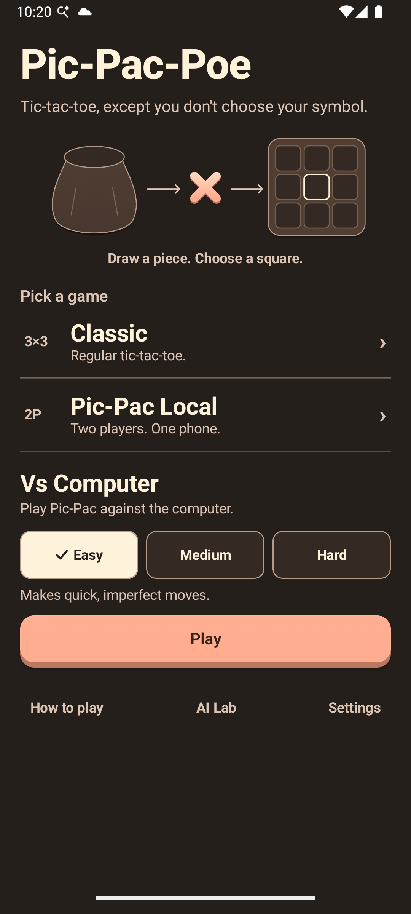
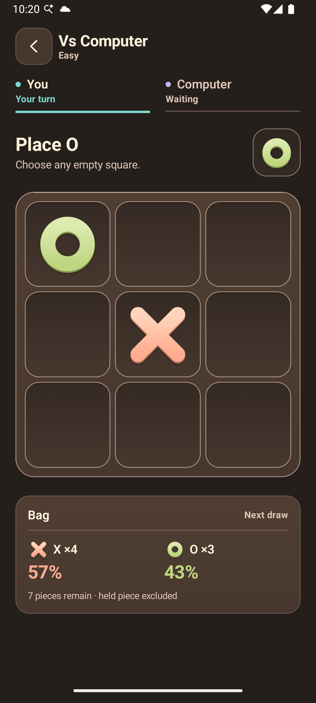

# Pic-Pac-Poe

Pic-Pac-Poe is a small offline strategy game built around one twist: players draw from a shared bag of five X and five O pieces, see the result, then decide where to place it.

Players are not X and O. Either player can place either symbol, and the player who completes any three-symbol line wins.

The Android remaster pairs a custom Compose interface with an exact stochastic-game solver, a deliberately constrained fair-AI boundary, and reproducible MCTS/RL experiments.

| Home | Pic-Pac turn |
|---|---|
|  |  |

The implemented **Form Playground 2.0** system uses cocoa surfaces, coral/pistachio pieces, a single recessed board and independent actor colors. See [the design-system and verification handoff](docs/form-playground-2.md) for portable tokens, presentation timing, accessibility contracts and screenshot provenance.

## Game modes

- **Classic:** local two-player Tic-Tac-Toe.
- **Pic-Pac Local:** pass the device, reveal the active player's piece, then choose its cell.
- **Pic-Pac AI:** play offline against Easy, Medium, or Hard.
- **AI Lab:** playable stochastic MCTS and a locally shipped tabular Q-learning policy.

The Pic-Pac turn order is intentionally strict:

```text
draw and remove piece -> reveal X/O -> choose empty cell -> evaluate -> switch player
```

Tap timing never influences a draw.

## Production AI

| Difficulty | Algorithm | Intent |
|---|---|---|
| Easy | Probability-aware heuristic | Immediate tactics, bag-weighted threats, controlled top-band variety |
| Medium | Depth-4 Expectiminimax | Adversarial decisions, exact chance probabilities, heuristic leaves |
| Hard | Full memoized Expectiminimax | Exact terminal search with stable move ordering |

The checked-in oracle tests establish:

- 11,065 reachable pre-draw chance states;
- 21,314 reachable post-draw decision states;
- 6,648 terminal states;
- **39,027 phase-aware states total**;
- empty-board optimal value `5/21` after either first symbol;
- center value `5/21`, every non-center opening value `11/126`.

Hard uses exact search because the game is small enough to solve. MCTS and reinforcement learning remain honest comparison tools rather than replacing the stronger conventional algorithm.

## Architecture

```text
:app        Compose UI, ViewModel, saved state, local effects/settings
   |             |
   v             v
:game-ai --> :game-core   immutable rules, session, safe observations/search model
   ^             ^
   |             |
:game-tools -----+        enumerator, paired tournaments, RL trainer
```

The environment owns the hidden bag and its private random source. Agents receive only an immutable `AiObservation` containing the public board, active/controlled players, held symbol, hidden counts, and legal cells. Agent randomness is independent. No agent receives a production session, bag, environment random source, seed, or future draw queue.

## AI Lab and reproducibility

`game-tools` provides three commands:

```powershell
.\gradlew.bat :game-tools:run --args="enumerate"
.\gradlew.bat :game-tools:run --args="tournament 20 20260826"
.\gradlew.bat :game-tools:run --args="train-rl 250000 policy.bin 7331"
```

Tournaments use independent deterministic seeds for the environment and both agents, pair both starting positions, and report W/L/D, starter splits, latency, nodes, and invalid decisions.

The shipped v1 RL artifact was trained for 250,000 self-play episodes. On its fixed seeded 1,000-state evaluation sample it reached **92.3% exact optimal-action agreement** with mean regret **0.0292**. This is a sampled measurement, not an optimality claim. See [the reproducibility report](docs/benchmarks/rl-policy-v1.md).

## Android product

- one edge-to-edge Compose activity;
- API 36 target, Java/JVM 17;
- phone/tablet/split-window adaptive game layout;
- native path-drawn resin X/O pieces, restrained contact motion and a static final winning line;
- deliberate local handoff/reveal experience;
- state-derived probability HUD;
- light/dark/system themes and reduced-motion option;
- local sound and haptics;
- ViewModel/StateFlow, `SavedStateHandle`, turn tokens, and cancellable AI work;
- no orientation lock and no Activity-owned game rules.

## Offline guarantee

The manifest requests **no Internet permission**. There is no Firebase runtime, analytics, ads, networking, remote model, or cloud AI. Settings use local DataStore and Android backup is disabled.

The `verifyNoInternetPermission` Gradle task inspects the merged release manifest and is attached to `check`.

## Build and test

Requirements: Android SDK 36, JDK 17, and the included Gradle wrapper.

```powershell
.\gradlew.bat clean check :app:assembleDebug :app:bundleRelease
```

The project stays on Android Studio's AGP 8.8 compatibility lane. Release shrinking is deliberately disabled because AGP 8.8's bundled R8 predates Kotlin 2.3 metadata support; re-enable it only alongside R8 8.13.19 or a newer compatible Android Studio/AGP lane. This trades a larger 2.0.0 artifact for a build configuration that is verified on the supported IDE lane.

The repository contains no signing key or signing secret. With no `ANDROID_UPLOAD_*` environment variables, `bundleRelease` intentionally produces an unsigned local AAB. The manually dispatched GitHub release workflow reads repository-level Actions secrets, materializes the upload key only at runtime and produces a private signed artifact; it does not publish to Google Play. Do not dispatch it until the original upload key and version code are confirmed.

## CI and release operations

- `.github/workflows/ci.yml` runs the authoritative clean verification on pushes and pull requests targeting `dev` or `main`.
- `.github/workflows/release.yml` accepts an explicit full commit SHA, reads repository-level Actions secrets, verifies the same gates, signs, verifies the AAB signature, and uploads the signed bundle as a private workflow artifact. No GitHub Environment currently exists, so there is no environment-review gate.
- Third-party workflow code is pinned to immutable commit SHAs, and the Gradle 8.10.2 distribution is protected by its published SHA-256 checksum.

Owner setup, Play Console checks, signing secret names, and the exact handoff sequence are documented in [the Play release checklist](docs/play-release-checklist.md). The 2.0.0 Play notes are in [docs/play/release-notes-2.0.0.txt](docs/play/release-notes-2.0.0.txt).

The suite covers conservation/probability invariants, all winning lines, player/symbol separation, invalid/stale/terminal commands, exact state enumeration and opening values, every-state legality for fast agents, seeded MCTS, policy serialization, paired tournaments, ViewModel reveal/rematch/recreation behavior, Compose product flows, and the merged-manifest offline assertion.

## Repository history

The pre-remaster dirty prototype is preserved on `codex/prototype-wip-20260826` at commit `22c64fd`. It is historical reference only; the remaster was built forward from committed `HEAD` rather than on the broken prototype.

## License and privacy

Source code is licensed under [Apache-2.0](LICENSE). The app's data behavior is described in [docs/privacy-policy.md](docs/privacy-policy.md); the owner must host that policy at a stable public URL before Play submission.
