# Portable behavior, AI, and state-machine contract

This is the normative behavioral supplement to [the iOS handoff](PIC_PAC_POE_IOS_HANDOFF.md). It describes the implemented Android release candidate, not a redesigned game. The source of truth for rules is the pure domain code; presentation timing and input gates are additional product contracts, not domain rules. Proposed Swift names below are implementation guidance, not an iOS application already present in this repository. [`golden-fixtures.json`](golden-fixtures.json) encodes representative rule, draw, probability, AI, terminal-presentation, handoff and restoration cases for independent execution on both platforms.

Read this document with [the machine-readable contract](state-machine.json), [the diagram source](state-machine.mmd), and [the Android-to-SwiftUI map](ANDROID_TO_SWIFTUI_MAP.md). All links are repository-relative and work from a clean clone.

## 1. Rules: actors are not symbols

### Modes and actors

| Mode | Actors | Symbol rule | Turn start | Result/rematch |
|---|---|---|---|---|
| Classic | Player 1 and Player 2, local | Player 1 always places X; Player 2 always places O, regardless of which player starts | Immediately playable, no bag or reveal | Completing actor wins; draw when full without a line; Rematch alternates starter |
| Pic-Pac Local | Player 1 and Player 2, pass-and-play | Each actor may draw/place either X or O | Private handoff screen, then explicit Ready, then reveal | Completing actor wins, not an owner of X/O; same mode, alternating starter on Rematch |
| Vs Computer | Human is domain `ONE`, displayed `You`; computer is `TWO`, displayed `Computer` | Same shared-bag Pic-Pac rules for both | Automatic, visibly sequenced turn start and reveal | `You win`, `Computer wins`, or `Draw`; preserve difficulty and alternate starter |
| AI Lab | Same human/computer actors | Exactly the same Pic-Pac rules | Same coordinator and presentation stages | Only opponent algorithm differs: MCTS or Q-learning |

Evidence: [Rules.kt][rules], [GameUiState / GameViewModel][vm], [HomeScreen.kt][home], [InfoScreens.kt][info]. `RandomAgent` is an offline baseline, **not** the product's Easy difficulty. AI Lab difficulties have `production = false` and are not in the Easy/Medium/Hard chooser.

### Board and victory

The board is 3×3. Portable cell index is zero-based row-major: `index = 3*row + column`, with both coordinates in `0...2`. Spoken coordinates are one-based. Cell indices outside `0...8` are programmer errors (`Cell.of` requires a valid index), not accepted game commands.

```text
0 1 2
3 4 5
6 7 8
```

The eight winning triples, in stable source order, are `(0,1,2)`, `(3,4,5)`, `(6,7,8)`, `(0,3,6)`, `(1,4,7)`, `(2,5,8)`, `(0,4,8)`, `(2,4,6)`. After a legal placement, check every line of the **placed symbol**. If one or more are complete, the actor who placed that piece wins. If no line is complete and all nine cells are filled, the result is Draw. Win takes precedence over full-board Draw. Multiple lines can complete on one move; the domain retains all, while the UI renders the first in stable order. A terminal game accepts no new draws or placements.

Do not infer line ownership from who placed earlier pieces. In Pic-Pac, a line can contain pieces placed by both actors. There is no score, series counter, undo, piece swapping, redraw, pass, or move after terminal in the implemented product. See [Model.kt][model], [Rules.kt][rules], and [PhysicalBoard.kt][board-ui].

### Shared bag and draw order

A fresh Pic-Pac bag contains exactly **5 X and 5 O**, ten pieces for at most nine board cells. Draws are without replacement. On each turn:

1. Determine the current actor from state.
2. Draw once using the current hidden counts.
3. Immediately remove that piece from the hidden bag and persist it as the held symbol.
4. Present the actual held symbol; do not roll through fake candidates or use input timing to determine it.
5. Allow that actor to choose any currently empty cell only after the reveal finishes.
6. Place the held piece, evaluate win before draw, and either terminate or switch actors.

The held symbol is public after the draw. The hidden bag has no pre-generated future queue available to AI. Production [Session.kt][session] uses a private `SecureRandom` source and samples integer `r` uniformly in `[0, hiddenTotal)`; draw X iff `r < remainingX`. Agents get only a snapshot and cannot invoke the production session or obtain its RNG. A Swift implementation can use an injected random source with an operating-system-backed production implementation; exact production draw sequences across platforms are **not** a parity requirement. Scripted draws in tests are.

### Conservation and probabilities

For symbol `S`, let `B_S` be pieces on the board, `R_S` be hidden pieces, and `H_S` be one when the held piece is S, otherwise zero:

```text
B_X + R_X + H_X = 5
B_O + R_O + H_O = 5
0 <= R_X,R_O <= 5
N_hidden = R_X + R_O
P(next X) = R_X / N_hidden
P(next O) = R_O / N_hidden
```

The source returns 0 for both probabilities if the denominator is zero; this defensive value does not arise as a normal pre-draw state on the nine-cell board. `AwaitingDraw` requires positive hidden total. A draw of an exhausted symbol is rejected. The HUD's probabilities describe the **next draw**, not a reroll of the piece already in hand. It uses the post-removal counts and `roundToInt(probability * 100)` for integer percentages; counts remain exact. Each item has one accessible description, e.g. `X, 2 remaining, 40 percent next draw`. The footer explicitly says the held piece is excluded when present. Do not derive probabilities from board occupancy alone if a held piece exists.

Evidence: [State.kt][state], `PicPacRules.draw`, `PicPacState.nextXProbability / nextOProbability`, [ProbabilityTray][panels].

### Worked examples

**Initial reveal and a normal next turn.** Start with empty board, actor Player 1, X=5/O=5 and probabilities 50%/50%. Drawing X yields held X, X=4/O=5, hidden total 9, and next-draw probabilities 4/9 and 5/9 (44%/56% in UI). Place X at cell 4. The counts stay 4/5, held piece disappears, board center is X, active actor changes to Player 2. If Player 2 draws O, counts become 4/4, held O, probabilities 50%/50%. A tap on occupied center is rejected without consuming the held O.

**Player 1 wins with O.** Legal scripted moves `(actor, draw, cell)` are `(1,O,0)`, `(2,X,3)`, `(1,O,1)`, `(2,X,4)`, `(1,O,2)`. Top row is OOO, and Player 1 wins with O. Hidden counts are X=3/O=2. This is an exact fixture in [RulesTest][rules-test].

**Player 2 wins with X.** `(1,O,0)`, `(2,X,3)`, `(1,O,8)`, `(2,X,4)`, `(1,O,1)`, `(2,X,5)` ends with XXX across the middle row and Player 2 as winner. See [RulesTest][rules-test].

**Using the other actor's earlier pieces.** `(1,X,0)`, `(2,X,1)`, `(1,O,4)`, `(2,X,2)` is legal Pic-Pac play. Player 2 completes XXX using Player 1's first piece and wins. This is a worked derivation of the rule, not a separately named Android test.

**Full-board draw.** The eight-piece board below, with held X and hidden counts X=0/O=1, accepts X at 8 without making a line; the one remaining O stays in the bag. For a computer move the domain is terminal at commit, but the result dialog waits through placing and settlement:

```text
X O X
X O O
O X _  -> put X in cell 8 -> Draw
```

This is the `computer draw move settles before draw result` fixture in [GameViewModelTest][vm-test].

### Starting players, new games, and rematches

The coordinator starts with `nextStarter = Player.ONE`, restored from saved state if present. `beginNewGame` increments the game revision and uses the existing `nextStarter`. A rematch sets it to the opposite of the just-finished game's `starter`, preserves mode and difficulty, and makes a new empty board/fresh 5+5 bag. **Starter changes only on Rematch, not on each ordinary Home → mode launch.** `goHome` clears the game but keeps `nextStarter` and revision; consequently a starter chosen by an earlier rematch can carry into a different mode launched later. Do not silently reset every Home launch to Player 1 if exact current behavior is required.

In Classic, a Player 2 start means O moves first; ownership does not change. In Vs Computer, a computer start still runs `TURN_START → REVEALING → targeting/placement/settlement`; it must not jump directly into a human reveal. The product exposes Rematch at the result, although the ViewModel's public `rematch()` method itself does not require terminal and is also exercised mid-turn in stale-callback tests.

### Rejection and invariants

| Command | Rejections, in source order | Required non-effect |
|---|---|---|
| Pic-Pac draw | Terminal; not AwaitingDraw; chosen symbol exhausted | No second removal, no replacement symbol |
| Pic-Pac place | Terminal; not AwaitingPlacement; token mismatch; occupied cell | Held piece, counts, board, actor unchanged |
| Classic place | Terminal; token mismatch; occupied cell | Board, actor, token unchanged |
| UI place | Not GAME; stage not PLAYING; in AI mode actor not human | No domain command occurs |
| Presentation callback | Not GAME; presentationId mismatch; stage not handled | No state advance |

`revision >= 0`; nonterminal boards have no winner; terminal Draw requires full board with no winner. `Board` stores each cell as a base-3 digit (empty=0, X=1, O=2), giving `3^9 = 19,683` board encodings. That encoding alone is **not** a complete Pic-Pac state: held symbol, hidden counts and phase matter. Tokens are `revision*16 + occupiedCount + 1` at turn creation; a Pic-Pac draw creates its placement token, while Classic creates one on new game and after nonterminal placement. Swift may use value types rather than the compact encoding, but must preserve identity and public semantics.

The public constructors are not an exhaustive arbitrary-save validator. For example, terminal-win metadata is trusted beyond the listed constructor requirements. Tests chiefly validate states reached through the rules. Validate decoded Swift snapshots comprehensively and fail closed rather than treating malformed external data as a legal game. Do not interpret that hardening recommendation as authority to alter legitimate transitions.

## 2. AI: public information, algorithms, exact numbers

### Boundary and product mapping

[AiApi.kt][ai-api] supplies immutable `AiObservation(board, activePlayer, agentPlayer, heldSymbol, remainingX, remainingO)` and derived legal cells. It requires conservation, a nonwinning nonfull board and valid counts. `from` only accepts AwaitingPlacement. Search types in [SearchModel.kt][search-model] deliberately omit production sessions/RNG and use current-actor negamax values. No future draw queue, timing-controlled draw, opponent hidden data, cloud inference or networking exists.

| Product/baseline | Implementation | Actual app configuration | Randomness / result |
|---|---|---|---|
| Random baseline | [RandomAgent][random-ai] | Not in Home or AI Lab chooser | Uniform legal cell using injected RNG |
| Easy | [HeuristicAgent][heuristic] | One probability-aware scoring pass | RNG initialized in ViewModel from `System.nanoTime()`; random immediate winning move or near-best band |
| Medium | [ExpectiminimaxAgent][exact] | `configuredDepth = 4`, `SearchLimits()` | Deterministic action with stable ordering; heuristic leaf evaluation |
| Hard | [ExpectiminimaxAgent][exact] | Default full terminal depth, `SearchLimits()` | Exact finite-game expected value, not guaranteed victory against randomness |
| AI Lab MCTS | [StochasticMctsAgent][mcts] | **2,000** simulations in ViewModel; class default is **1,000** | Independent RNG seeded with `System.nanoTime() xor 0x4D435453` |
| AI Lab Q-learning | [RlPolicyAgent / TabularPolicy][policy] | Bundled versioned policy, loaded lazily | Deterministic greedy lookup when policy nonempty; heuristic if whole table unavailable/empty |

Android's app passes empty `SearchLimits`: no production deadline or node limit is configured. Offline experiments may supply bounds. Never describe the app's MCTS as 1,000 simulations, its Easy as uniformly random, or Hard as a sampled/unbeatable agent. All chosen moves still pass coordinator and domain legality guards.

### Shared ordering and heuristic evaluator

`PositionEvaluator.ordered` ranks legal cells `4, 0, 2, 6, 8, 1, 3, 5, 7`: center, corners in that order, then row-major edge cells. For a candidate move:

```text
if move wins: score = 100000
else if board full: score = 0
else:
    score = 22 * geometry(afterBoard, heldSymbol) + positionBonus(cell)
    score -= Σ_symbol P(opponent draws symbol) * immediateThreatCost(opponentDecision)

positionBonus = 22 for center, 10 for a corner, 4 for an edge
immediateThreatCost = 0 if no winning reply
                     520 if one winning reply
                     760 + 80*(winningReplies-2) otherwise
```

`geometry` sums per line: 12 for two focused symbols + one empty; 3 for one focused symbol + two empty; 4 for two opposite symbols + one empty; 1 for one opposite symbol + two empty; 0 otherwise. These are actor-neutral pattern features, not X ownership or O ownership. Easy first finds immediate winning moves and samples uniformly among them; otherwise samples uniformly among candidates `score >= best - 8`. It ignores search depth/budget arguments. Leaf value is `clamp(tanh(maxLegalActionScore / 260), -0.95, +0.95)`.

Evidence: [PositionEvaluator.kt][evaluator], [HeuristicAgent.kt][heuristic]. Preserve these exact constants for behavior parity before experimenting with a new difficulty.

### Expectiminimax / Hard oracle

The observation is a post-draw decision state. Action values are measured for the current actor; chance draws transfer the decision to the other actor and therefore negate its expected value:

```text
Q(s,a,d) = 1                              when placement wins
           0                              when placement draws
           -Σ_t [R_t/(R_X+R_O)] V(draw(place(s,a),t), d-1) otherwise

V(s,0) = boundedHeuristic(s)
V(s,d) = max_a Q(s,a,d)
```

Root depth is `min(configured or supplied depth, empty cells)`. Hard searches to terminal and Medium uses depth 4. Chance weights are exact remaining-count fractions, not independent 50/50 flips. Unavailable symbols contribute no branch. The solver uses no alpha-beta pruning or symmetry canonicalization; memoization is a `HashMap<Long, Double>` initially sized 40,000, retained on the agent across calls. Per-call node/cache-hit/depth counters reset, the cache does not. Cache key is:

```text
boardCode | (heldIsO << 15) | (remainingX << 16) |
(remainingO << 19) | (depth << 22)
```

Stable root ordering resolves equal values: take the first action within absolute `1e-12` of the best value. Nodes count entry to recursive value evaluation, not every loop or root action. Cancellation is checked every 256 counted nodes. A requested node budget throws after `nodes > budget`; deadline uses monotonic `nanoTime`. A `SearchLimitReached` causes full fallback to heuristic with node/deadline cleared; this is not iterative deepening or “return best partial root result.” App-level unexpected exceptions instead fall back to the observation's first row-major legal cell.

Exact oracle acceptance from [AgentTest][agent-test]: after either first held symbol, center value is **5/21**, every noncenter value **11/126**, and chosen cell 4. [ReachabilityTest][reach-test] and [ToolsTest][tools-test] require **11,065 chance + 21,314 decision + 6,648 terminal = 39,027 phase-aware states**. Counts intentionally omit actor identity under actor-symmetric search; they are not an enumeration of saved UI states.

The solver is mutable and not thread-safe. Swift should isolate one solver/cache in a worker actor, or use request-local solvers; do not concurrently mutate one shared cache. A new game cancels prior work on Android, but a Swift design should also serialize cache access and revalidate every delivered result on the main actor. `SearchLimits.maxDepth=0` is accepted by the API but is not a product configuration or a tested search contract; the current root action recursion does not provide a clean zero-ply cutoff. Port/test supported positive depths and full search first, not this unused edge-case behavior.

### Stochastic MCTS

Each call creates a fresh tree. A decision node owns untried legal actions, action edges, visit/value statistics and `rootSign` (`+1` root actor, `-1` opponent). An action edge has distinct children keyed by the sampled next symbol. Expansion chooses uniformly from untried actions. Fully expanded nodes select:

```text
UCT(edge) = node.rootSign * edge.meanRootReward
            + sqrt(2) * sqrt(ln(max(parent.visits,1)) / edge.visits)
```

Zero-visit edges score positive infinity. Reward always remains in root perspective during backpropagation; **opponent selection negates exploitation** through `rootSign`. Chance sampling is proportional to remaining X/O counts, without replacement. At a newly created child, rollout takes an immediate winning move if one exists (random among ties), otherwise a random legal move, and alternates sign after each nonterminal placement. Terminal rewards are +1/-1 for root win/loss and 0 for draw. Every statistic on the selected path increments once and accumulates the same root-perspective reward.

Final action: most visits, then highest mean root reward, then stable center/corner/edge move rank (equivalent to the order above). If a deadline prevents any simulation/edge, fallback is the first row-major legal cell. `nodeBudget` is interpreted here as **simulation count**, not created tree nodes; `maxDepth` is not used. Cancellation is checked each simulation, and deadline before each simulation. Diagnostics report actual completed simulations, nodes created (initial root included), max depth, elapsed time, value, zero cache hits. Seeded equivalence is proven for 400 simulations/seed 77 in [AgentTest][agent-test]; it proves repeatability and legality, not optimality or win-rate superiority. The app's 2,000 setting must remain distinguished from the test and the offline 1,000-simulation tournament configuration.

### Q-learning policy and artifact portability

The app performs lookup only; it does **not** train on the phone or collect play history. [RlTrainer.kt][trainer] is an offline negamax Q-learner. Per episode:

```text
epsilon = max(0.02, 1 - episode / (episodes * 0.85))
alpha(state,action) = 1 / sqrt(visits(state,action))
target = +1 for immediate win; 0 for draw; -max Q(nextState,*) otherwise
Q <- Q + alpha * (target - Q)
discount = 1
```

Environment RNG uses seed; exploration RNG uses `seed xor 0x51F15EED`. The committed policy was trained for 250,000 episodes with seed 7331. The historical [reproducibility report](../benchmarks/rl-policy-v1.md) records 21,207 learned states, 202,634 wins and 47,366 draws, mean absolute TD error 0.2121550392. Its seeded 1,000-state sample has 92.3% exact optimal-action agreement and mean regret 0.0292119048. These are prior artifact-specific sample results, **not** a fresh measurement or a global optimality claim.

The actual asset is [picpac_rl_policy_v1.bin][policy-asset], **891,749 bytes**, SHA-256 `9b05cc725ab8b52cecb940b6c823cb66e843acf462511c87d2ab3e1c834152b1` (checked against the file during handoff preparation). Do not duplicate it into the handoff. A Swift loader may read this binary directly:

| Field | Format |
|---|---|
| Magic | big-endian Int32 `0x50505051` |
| Version | big-endian Int32 `1` |
| Rules ID | Java `DataOutputStream.writeUTF` string (unsigned 16-bit byte count plus modified UTF-8); this ASCII value is `picpac-5x5-draw-before-place-v1` |
| Row count | big-endian Int32, reader requires `0...100000` |
| Each row | big-endian signed Int64 key followed by nine big-endian IEEE-754 Float32 values in cell-index order |
| Row ordering when written | ascending key; all-zero rows omitted |
| Key | board code OR held-is-O at bit 15 OR remainingX at bit 16 OR remainingO at bit 19 (no depth) |

Greedy lookup considers only legal cells. Stable shared ordering breaks equal Q values; missing rows/action values are zero. Importantly, a missing row in a **nonempty** table does not trigger heuristic fallback: it chooses the first best zero-valued legal cell. Only failure to load/the whole empty table triggers heuristic. Reuse the existing version/rules ID and test byte-for-byte header decoding, selected-row values, all legal-cell masks, and artifact hash. Do not retrain merely to port the app, or assume Swift's built-in RNG reproduces Kotlin's seeded stream.

### Offline tools and determinism

[MatchRunner.kt][matches] supplies a separate environment seed and two independent agent seeds. Tournaments pair the same seed with starter 0 and starter 1 and instantiate fresh agents per game. Default CLI: 20 pairs, seed 20260826; matchups Random vs Heuristic, Heuristic vs Exact, MCTS-1k vs Exact. Each decision has both a 2,000ms coroutine timeout and monotonic deadline; throw/timeout/illegal action is an invalid move and a forfeit. This timeout belongs to the **tool**, not the shipped app. Metrics include wins, losses, draws, starter wins, invalids, average plies, total per-game agent latency averaged over games, and average nodes. They are not per-animation frame-time measurements.

For a fixed Kotlin seed/runtime, tools and seeded agents are repeatable except measured latency. Swift RNGs have different streams; use scripted random integers or adopt a documented portable generator for cross-language stochastic fixtures. Hard/Medium exact action values and tie order, domain transitions, Q artifact lookup, and state-machine guards should match without needing RNG sequence parity. An independent Swift graph enumerator plus oracle values is more valuable than syntax translation.

## 3. Presentation coordinator: separate from the rules



[Editable Mermaid source](state-machine.mmd). The diagram shows the exposed product paths. Direct test/restart commands may replace any live game using the same cancellation/new-revision rules; they do not add a visible restart control.

The underlying Pic-Pac phase has only `AwaitingDraw`, `AwaitingPlacement(held,token)`, and `Terminal(outcome)`. `TurnStage` adds understandable, interruptible presentation beats. These layers must **not** be collapsed into a single boolean such as `isComputerTurn` or `showReveal`.

### Stage contract

| Stage | Domain state / visible actor | Visible information and input | Normal / Reduced Motion delay |
|---|---|---|---|
| `HANDOFF` | Local AwaitingDraw; next local actor | Actor number/name, pass phone message, Ready and Home. Board and bag are absent from the tree, not just dimmed. No cell input | None; explicit Ready |
| `TURN_START` | AI-mode AwaitingDraw; actual next actor | `Your turn` or `Computer's turn`; shared-bag explanation; no held symbol; board locked | 300 / 160ms |
| `REVEALING` | AwaitingPlacement; actual drawing actor | Modal actor + actual symbol. Local says `You drew X/O` with actor label above; computer mode says `You drew` or `Computer drew`. No board input; underlying semantics suppressed | 650 / 500ms |
| `PLAYING` | Classic nonterminal or human/local AwaitingPlacement | `Place X/O`, held piece, empty-cell targets enabled. Occupied cells always disabled | None; actor input |
| `AI_THINKING` | Computer AwaitingPlacement; Computer | `Computer is thinking`, actual held symbol; all cells locked | None; computation bound only by completion/cancellation |
| `AI_TARGETING` | Computer AwaitingPlacement; Computer | `Square selected`, row/column and double target rim; held/selected symbol retained. Board not yet mutated | 280 / 160ms |
| `AI_PLACING` | Board already contains the computer move; domain may already be human AwaitingDraw or Terminal; display **Computer** | `Placing X/O`, selected cell and placed symbol; locked. Victory line may already exist. Do not reveal next human piece | 340 / 180ms |
| `AI_SETTLING` | Same committed board and domain as placing; display **Computer** | `Move placed`; same target/symbol, locked and readable | 480 / 320ms |
| `TERMINAL` | Terminal domain result | Modal result + noninteractive final board, Rematch/Home; no live board actions | None; explicit action |

This table is sourced from [GameUiState.displayedPlayer][vm], [GameScreen / PresentationClock][screen], [TurnInstructions and PlayerTurnHeader][panels], [PhysicalBoard][board-ui]. Reduced Motion retains all logical beats and essential readability delays; it does not bypass directly from AI choice to human input. Decorative contact movement can disappear independently of these timers.

### Full transition table

All timed callbacks first require `screen == GAME` and exact current `presentationId`. `advanceStage` increments the coordinator's presentation counter. “Accepted place” below also means legal cell/token/phase under the domain rules.

| From → to | Cause / guard | Side effects and state changes |
|---|---|---|
| Outside → PLAYING | Start Classic | Cancel old AI, increment revision, create empty Classic session using nextStarter |
| Outside → HANDOFF | Start Pic-Pac Local | Same replacement cleanup; fresh bag, advance presentationId |
| Outside → TURN_START | Start AI/AI Lab | Same cleanup; fresh bag, selected difficulty, advance presentationId |
| HANDOFF → REVEALING | Ready; current stage HANDOFF | Session draws/removes once; clear pending result/target/symbol; set revealAcknowledged=false; persist held symbol/token; increment presentationId; emit REVEAL |
| TURN_START → REVEALING | Current timer callback | Same draw effects; if computer, dispatch AI immediately with this post-draw observation |
| REVEALING → PLAYING | Reveal timer; local or human actor | Set revealAcknowledged=true; advance stage/id; unlock only empty human/local cells |
| REVEALING → AI_TARGETING | Reveal timer; computer; valid result already pending | Acknowledge reveal, retain chosen target and held symbol; advance stage/id; no board commit yet |
| REVEALING → AI_THINKING | Reveal timer; computer; result not ready | Acknowledge reveal; advance stage/id; remain locked |
| AI_THINKING → AI_TARGETING | Decision arrives; request's turn token still matches, actor computer | Persist target/symbol; advance stage/id; begin target timer |
| AI_TARGETING → AI_PLACING | Target timer; pending decision exists; revision AND turn token match session; actor computer; cell empty | Consume pending decision; commit exactly one domain placement; retain target + precommit held symbol as aiMoveSymbol; advance stage/id; emit PLACE, WIN or DRAW |
| AI_PLACING → AI_SETTLING | Current placing timer | Advance stage/id only; no second placement, draw or actor-label switch |
| AI_SETTLING → TURN_START | Current settling timer; domain nonterminal | Clear target/symbol, advance stage/id; only now visually move to next human actor |
| AI_SETTLING → TERMINAL | Current settling timer; domain terminal | Advance stage/id; retain terminal board; present result; never start another draw |
| PLAYING → PLAYING | Legal nonterminal Classic tap | Commit fixed actor symbol, switch domain actor, next token; PLACE effect; no presentationId increment needed |
| PLAYING → HANDOFF | Legal nonterminal Local tap | Commit held symbol, switch actor, AwaitingDraw, PLACE effect; advance stage/id |
| PLAYING → TURN_START | Legal nonterminal human AI-mode tap | Commit, switch actor to computer, AwaitingDraw, PLACE effect; advance stage/id |
| PLAYING → TERMINAL | Human/local/Classic placement ends game | Commit result immediately, emit WIN/DRAW; human result does not use AI settling stages |
| TERMINAL → mode's initial stage | Rematch | Opposite previous starter; same difficulty/mode; cancel work; increment revision; fresh session |
| Any → Home | App Back/Home; modal Back requests Home | Cancel AI, clear pending/reveal acknowledgement and sessions/saved game; default Home state; preserve nextStarter/revision |
| Any → replacement game's initial stage | Explicit new-game command; used by tests | Cancel work, increment revision, new session; stale callbacks cannot apply |

### Early versus late computation, with clocks

```text
Computer TURN_START                REVEALING                 TARGETING   PLACING   SETTLING
normal: 300ms                      >=650ms visible          280ms       340ms     480ms
                                     | search starts
fast:                                +-- result ready --wait--+
slow:                                +----- still running --> AI_THINKING --> result --> target
```

Search and the reveal run concurrently. A fast result is stored, not shown early. A slow result causes AI_THINKING after the full reveal, with no invented minimum or maximum thinking presentation delay. With an immediate decision, the computer sequence from TURN_START to settled handoff/result is **2,050ms normal / 1,320ms reduced** (300+650+280+340+480 or 160+500+160+180+320), plus rendering/scheduling. If nonterminal, the next human's TURN_START and REVEALING add another **950ms / 660ms** before PLAYING. These sums are derived from specified delays, not measured device latency guarantees. Search taking longer than the reveal adds the extra wait.

### Identity, guards and concurrency

There are three different identifiers; preserve their purposes:

| Identity | Changes when | Protects against |
|---|---|---|
| Game `revision` | `beginNewGame`, including Rematch | Previous-game AI result committing into a new board |
| `TurnToken` | New placement turn | Old held-symbol/move command on a newer turn |
| `presentationId` | `advanceStage` | Timer callback replay after stage change, rematch, or Home |

The worker returns a `PendingAi(AiRequest(revision,token),cell)`. `beginAiTargeting` currently checks matching turn token and computer actor; `applyAiDecision` explicitly checks both revision and token plus empty cell/computer actor. Token construction embeds revision, but keep the explicit revision check at actual commit. The callback dispatcher's GAME/id check prevents later placement on a hidden screen. Cancellation is cooperative (`viewModelScope`, cancellable `withContext(Dispatchers.Default)`); failures other than cancellation produce the first legal-cell fallback. `cancelAi` cancels the job and clears pending data and reveal acknowledgement. It is called on new game, Home, and `show` of non-GAME screens. The UI only exposes navigation to supporting screens from Home; there is no supported “leave live game for Settings and resume” flow.

Suggested Swift design: immutable `GameSnapshot` + a `@MainActor` observable `GameCoordinator`; pure `GameRules`; separate cancellable worker `Task`/actor for AI; one stage task owned by visible gameplay and keyed by game revision/presentation ID. Feed commands into the coordinator, never mutate game state from a drawing view. On delivery, validate the current request again even when task cancellation was requested. Preserve target/symbol in the snapshot, not only local view animation state. Do not use a completion callback from a spring, an opacity transition, haptic or audio playback as the authority to commit a move.

## 4. Persistence, restoration and interruption

### Exact Android snapshot fields

[GameViewModel.persist / saveClassic / savePicPac][vm] records in `SavedStateHandle`:

| Keys | Meaning / restore behavior |
|---|---|
| `screen`, `mode`, `difficulty`, `stage` | Enumerated UI context and presentation stage |
| `presentation_id` | Current presentation identity; also seeds next id counter |
| `ai_target`, `ai_symbol` | Target index and selected/placed symbol across targeting, placement and settlement |
| `revision`, `next_starter` | New-game identity and future starter |
| `kind`, `board`, `active`, `starter` | Session type, base-3 board and actor metadata |
| `token` | Current placement token |
| `remaining_x`, `remaining_o` | Hidden counts for Pic-Pac |
| `phase` | `draw`, `place`, `terminal` |
| `held` | Held symbol when phase is `place` |
| `outcome`, `winner`, `win_symbol` | Outcome (`draw`/`win`/null) and winning actor/symbol; lines recomputed from board on restoration |

Transient job, solver cache, pending pre-target decision, `revealAcknowledged`, haptic/sound `effectId/effect`, animation progress, and elapsed stage time are **not** saved. A normal Activity rotation retains its ViewModel; process/coordinator recreation reconstructs sessions from the snapshot. Save-backed recreation tests do not prove arbitrary force-stop/disk-relaunch durability: Android SavedStateHandle is saved-instance restoration, not a durable match database. Home deliberately clears the saved match; no match-history database exists.

### Restore matrix

| Snapshot stage | Restore action | Non-negotiable |
|---|---|---|
| Local HANDOFF / any AwaitingDraw | Rebuild session; wait for current handoff/timer | Do not draw while reconstructing state |
| Human/local REVEALING | Keep same held symbol/counts; restart current presentation | Never redraw/remove twice |
| Computer REVEALING | Keep held piece; relaunch AI; reveal unacknowledged | Result must still await visible reveal |
| AI_THINKING | Keep held piece; mark reveal acknowledged; relaunch AI | Do not replay completed draw/reveal |
| AI_TARGETING with target | Reconstruct pending request from persisted revision/token/target | Use identical target, no recomputation/reroll |
| AI_PLACING / AI_SETTLING | Board is already committed; retain target/symbol; resume presentation | No second placement; still display Computer |
| TERMINAL | Keep outcome/board; no AI launch | Do not start a new turn |
| Classic PLAYING | Rebuild board, active actor, token | Symbol ownership and selected rematch starter survive |

The current `PresentationClock` is a Compose `LaunchedEffect(presentationId, stage, reducedMotion)` with `delay(duration)`. The coroutine is cancelled when that composable/key leaves. Re-creation starts the **full duration of the current stage**, not the remaining milliseconds. A Reduced Motion toggle restarts that stage's timer under the reduced duration. Platform dialog window animations are set to zero so they cannot extend reveal timing.

There is **no explicit game scene/background pause protocol**. `collectAsStateWithLifecycle` manages state collection, but the stage coroutine itself is not wrapped in a foreground lifecycle gate and a ViewModel worker can continue while its owner exists. Do not claim Android guarantees a frozen turn in the background. The separately gated Home illustration described below does not change this game-state limitation. For native iOS, explicitly decide/test scene-phase suspension: recommended pause presentation visibility and resume the same persisted stage without replaying draws; worker results can be retained pending on the main actor. That is a platform adaptation which must keep the already-committed board and input gates correct, not an excuse to reorder the game.

`restoreState` catches failures in session reconstruction and returns Home after clearing the game. Some enum parsing occurs before that `try`; an arbitrary malformed enum is not covered by the fallback. AI_TARGETING with a missing target launches search but does not establish normal acknowledgement, so corrupted/incomplete targeting snapshots are not a proven recovery path. These are pre-existing malformed-snapshot limitations, not normal-session behavior and not changes requested in this handoff. Swift should validate these cases explicitly and return safely to Home or a documented recoverable stage.

### Settings and decorative Home lifecycle

`SettingsStore` stores local booleans `sound=true`, `haptics=true`, `reduced_motion=false` and theme enum `SYSTEM` by default in `pic_pac_settings`; invalid saved theme falls back to SYSTEM. Settings changes persist asynchronously. There is no Android system Reduce Motion binding in this store. iOS should honor system Reduce Motion as well as the product preference without changing the essential stage sequence.

Home entrance consumption is separate from game saved state: [PicPacApp][app-ui] uses `rememberSaveable` for `titleEntranceConsumed`, outside screen transitions. It waits for initial stored settings before starting decorative motion, consumes at entrance start, and does not replay on brief Home return or recreation (including mid-entrance recreation). See [BrandLifecycleTest][brand-life-test] and the motion specification for exact title transforms. Do not attach title replay to any game turn, theme switch, screen recomposition, or rematch.

The bag→symbol→board Home illustration is a separate local visual loop: fixed 44 dp production X/O pieces alternate deterministically every 1400 ms, with one restrained pulse and crossfade under normal motion. Reduced Motion removes scale but keeps a 400 ms crossfade; platform animator scale zero uses instant1400 ms swaps. It starts from X after each restart and runs only after persisted settings load, while the illustration is visible and lifecycle RESUMED. Offscreen/inactive/disposed stops its work; no phase is saved. The entire illustration has the stable description “A random X or O is drawn from the bag, then placed on the board.”, with no live region or repeated symbol announcements. This explanation never consumes RNG, draws from the real bag, calls AI, advances presentation, changes navigation or modifies game saved state. It emits neither haptics nor sound. See [motion-spec.json](motion-spec.json) for the full timing and transform contract.

Feedback effects are emitted at reveal or accepted placement. A computer's WIN/DRAW effect is emitted at domain commit into AI_PLACING, **not** at result-dialog appearance. The current effect machinery is transient, not an exactly-once durable event log. Human physical sound/haptic quality and full TalkBack/VoiceOver announcements require device testing; semantics assertions cannot certify either.

## 5. Test evidence and Swift acceptance matrix

Load [`golden-fixtures.json`](golden-fixtures.json) as test data rather than rewriting its examples into platform-specific literals. Android and iOS runners should reject unknown schema versions, validate nine-cell row-major boards, and report fixture IDs on failure. Scripted randomness is an explicit bounded integer result, not a promise that Kotlin and Swift seeded generators share streams. The JSON covers representative cases; the exhaustive 39,027-state traversal and every-reachable-state legality checks remain generated tests rather than a 39,027-row checked-in file.

Named tests below are source evidence, not a claim that they were all rerun at the time this supplement was written. The release verification report records the actual run results. Preserve both pure tests and end-to-end tests; deterministic stage fixtures do not prove live game flow.

| Area | Android proof | Swift/XCTest/XCUITest acceptance |
|---|---|---|
| Eight lines / actor-symbol separation | [RulesTest][rules-test]: `all eight winning lines are recognized`, `player one can win with O`, `player two can win with X` | Iterate each triple and both symbols; assert winner is completing actor, including mixed-actor prior pieces |
| Draw/removal/conservation | `draw removes held piece before placement and conserves bag`, `exhausted symbol cannot be drawn`, `scripted environment samples both sides of initial five-five split` | Script boundary RNG values; require counts and probabilities before/after reveal, exhaustion 0%/100%, held piece excluded |
| Illegal/stale/terminal | `stale occupied and terminal moves are rejected`; VM `rapid duplicate placement is accepted once` | Immutable rejected snapshots, no duplicate removal/placement, all nine cells rejected in locked stages |
| Classic ownership | `classic fixes symbols to players` | Player 2 starter still O, win/full-board evaluation precedence |
| Complete rules graph | [ReachabilityTest][reach-test] and [ToolsTest][tools-test] canonical graph tests | Independent enumerator yields 11065/21314/6648/39027 with same phase-aware keys |
| Exact search | [AgentTest][agent-test]: `exact opening values match independent oracle` | Both first held symbols yield cell 4; 5/21 center and 11/126 others, tolerance 1e-12 |
| Fast-agent legality | `random and heuristic are legal across every reachable decision state`; immediate-win test | Exhaustively test 21314 decision states, immediate wins with either symbol |
| Fair-AI boundary | `agent constructors cannot receive production session capabilities` | Protocol/data boundary admits observation and independent RNG only; no production session/environment RNG/seed/future queue |
| MCTS | `stochastic MCTS is seeded bounded and legal` | Same scripted/portable seed produces same move/count; 400 simulations in fixture, 2000 product config; opponent sign/chance-weight tests |
| Q policy | `tabular policy artifact is versioned and round trips`; [ToolsTest][tools-test] learner test | Parse actual asset hash/header/rows; greedy tie order/missing-row behavior; bad version/rules ID rejected |
| Reproducible tools | `paired tournament is reproducible and swaps starters` | Same seeded script yields same W/L/D and invalid count, excluding timing; verify independent streams |
| Local handoff | VM `local turn hands off then reveals before placement`; [ProductFlowTest][flow-test] `localModeRequiresReadyBeforeReveal` | No board/bag subtree until Ready; reveal actual piece; unlock only after full duration |
| Early AI | VM `computer turn is serialized between human reveals and gates input` | Deliver result during reveal; hold it; target before commit; settle before human turn |
| Late AI / locked input | VM `all locked presentation stages reject human placement without any state change` | Delay worker behind a controllable gate; reveal completes into THINKING; no cell input before final human PLAYING |
| Stale stage callback | VM `restart during computer targeting rejects stale presentation callback`, `completed presentation callbacks cannot be replayed in later stages or after going home` | Deliver callbacks twice, out of order, after Home and after Rematch; exact current snapshot unchanged |
| Cancelled worker | VM `cancelled late AI decision cannot mutate a replacement game` | Release an old gated worker after new Classic/game; no mutation |
| Held piece recreation | VM `saved held piece survives recreation` | Encode/decode snapshot, retain exact held symbol/counts/token without drawing again |
| Target/commit recreation | VM `computer targeting survives recreation without replaying the draw`, `target and symbol survive every committed computer placement beat and recreation` | Recreate at targeting/placing/settling, same target/symbol, correct board count, displayed Computer; commit once |
| Terminal computer settlement | VM `computer winning move settles before result and never starts human draw`, `computer draw move settles before draw result` | Winning/full-board move goes PLACING → SETTLING → TERMINAL, no human draw; preserve final position |
| Timing | VM `presentation clocks retain the committed normal and reduced timing contracts`, `reduced motion keeps every presentation beat readable` | Fake-clock exact delay map; stages with no clock remain event-driven; no zero-duration essential reveal |
| Actor/result copy | VM actor labels, human-win and cell-announcement tests | AI mode says You/Computer, row/column target vs placed symbol, direct `You win`, no actor inferred from X/O |
| Live flow | [ProductFlowTest][flow-test] Classic win/rematch/recreation and `computerCompletesOneTurnAndReturnsControlOnlyAfterSettlement` | UI-only commands exercise real coordinator/worker and permit next human move only after settlement |
| Both-theme/reduced stage semantics | [FormPresentationTest][presentation-test] `everyComputerStageKeepsInputLockedAndActorIdentityExplicit` | Fixtures render every stage in both themes and motion settings; locked semantics and actor naming preserved |
| Geometry/privacy/adaptation | Form tests for equal cells, hidden handoff, narrow/large-font and wide layout | Stable board hit regions, 48dp-equivalent Android reference; native iOS minimum target, large-text scrolling, no information leak behind handoff |
| Home lifecycle | [BrandLifecycleTest][brand-life-test] both recreation/return tests | Consumed entrance never restarts; reduced motion immediately final; initial settings loaded before motion |

Additional Swift tests warranted beyond explicit Android assertions: terminal Win takes priority on the ninth move; one move completes two lines; Classic Player 2 begins; new-mode launch retains nextStarter; policy missing row in a nonempty table; MCTS opponent selection sign; deadline before first simulation; malformed snapshot fallback; foreground/background transitions. These are documented source behaviors/risks, not falsely claimed completed Android tests.

## 6. Native architecture and performance guardrails

| Android responsibility | Native Swift recommendation | Contract |
|---|---|---|
| `game-core` immutable values/rules | Pure Swift package/value types, Codable snapshot | No SwiftUI, clock, persistence, haptic or RNG hidden inside deterministic transition functions |
| Session private RNG | Injected environment source used only by session/coordinator | Separate from every agent's RNG; draw exactly once |
| `game-ai` algorithms | Swift worker actor/services conforming to async move protocol | Public observation only; cooperative cancellation; value/tie/limit parity |
| `GameViewModel` | Main-actor observable coordinator + reducer-style commands | Single authority for board, token, revision, actor, stage, pending target |
| `PresentationClock` | Cancellable stage task keyed by presentation identity | Clock acknowledgement only; never chooses a move or symbol |
| Compose UI | SwiftUI rendering of snapshot | Empty-cell interaction enabled only from derived state; fixed cell geometry |
| SavedStateHandle/DataStore | Versioned Codable restoration snapshot + native preferences | Preserve held piece and committed target; no promised match history |
| `game-tools` | Offline reference/optional Swift test utilities | Keep training and tournament costs out of app/UI thread |

The Android code is modular but not currently Kotlin Multiplatform: production session uses Java `SecureRandom`, policy I/O uses Java streams, tools use JVM filesystem/runtime, and app lifecycle/settings are Android. Native Swift rules/AI are small and independently verifiable against complete graph/oracle fixtures. KMP is not justified as an initial prerequisite; reconsider only if cross-platform maintenance or future model size supplies a concrete benefit. Retain the Android clone as read-only evidence; create iOS separately.

Do not run exact search, MCTS simulations, policy parsing or training on the UI thread. Android uses Dispatchers.Default for `chooseMove`; policy construction is lazy when first selected (current loader access is initiated during agent selection), so Swift should explicitly load/validate the small bundled table off the main actor. AI algorithms are bounded by the finite board, but Hard has no app timeout and MCTS's 2,000 simulations are not a millisecond guarantee. Retain asynchronous THINKING when required. Exact-search warm caches change runtime but not move semantics. Avoid unbounded continuous redraw/spinners unless useful; current stage status itself is enough. Stage timing is a readability contract, not a performance benchmark. Use physical iOS frame measurements before declaring smoothness, and keep emulator measurements labeled as such.

## 7. Do not change these facts during the port

- Draw **before** placement, remove exactly once, show actual held symbol, and exclude it from next-draw counts.
- Players are independent of symbols in Pic-Pac; only Classic binds Player 1=X and Player 2=O.
- All AI agents share the same lawful public observation; none can inspect or influence future environment draws.
- Hard is exact expected-value search; Easy is heuristic; Medium is depth 4; MCTS and Q-learning remain experimental choices.
- Human input is locked outside PLAYING; a visually dim board must not remain actionable or screen-reader enabled.
- Keep computer reveal, selected-cell focus, committed placement and settled result as separate stages, with Computer visible through settlement.
- Never show a human reveal after a terminal computer move or commit a computer move twice after recreation.
- A local handoff removes board/bag semantics and drawing, not just touch handling.
- Revision/token/presentation identifiers are distinct stale-work protections. Animation completion cannot replace them.
- Reduced Motion removes decorative travel, not explanatory turn sequencing. Keep actual essential delays.
- Restore held symbol, hidden counts, target and selected symbol; never reconstruct by drawing again.
- Keep the app offline with no analytics, ads, cloud AI, downloaded fonts, user accounts or training telemetry introduced by the port.

[model]: ../../game-core/src/main/kotlin/com/thevaguebox/picpac/core/Model.kt
[state]: ../../game-core/src/main/kotlin/com/thevaguebox/picpac/core/State.kt
[rules]: ../../game-core/src/main/kotlin/com/thevaguebox/picpac/core/Rules.kt
[session]: ../../game-core/src/main/kotlin/com/thevaguebox/picpac/core/Session.kt
[ai-api]: ../../game-core/src/main/kotlin/com/thevaguebox/picpac/core/ai/AiApi.kt
[search-model]: ../../game-core/src/main/kotlin/com/thevaguebox/picpac/core/ai/SearchModel.kt
[random-ai]: ../../game-ai/src/main/kotlin/com/thevaguebox/picpac/ai/RandomAgent.kt
[heuristic]: ../../game-ai/src/main/kotlin/com/thevaguebox/picpac/ai/HeuristicAgent.kt
[evaluator]: ../../game-ai/src/main/kotlin/com/thevaguebox/picpac/ai/PositionEvaluator.kt
[exact]: ../../game-ai/src/main/kotlin/com/thevaguebox/picpac/ai/ExpectiminimaxAgent.kt
[mcts]: ../../game-ai/src/main/kotlin/com/thevaguebox/picpac/ai/StochasticMctsAgent.kt
[policy]: ../../game-ai/src/main/kotlin/com/thevaguebox/picpac/ai/TabularPolicy.kt
[policy-asset]: ../../app/src/main/res/raw/picpac_rl_policy_v1.bin
[trainer]: ../../game-tools/src/main/kotlin/com/thevaguebox/picpac/tools/RlTrainer.kt
[matches]: ../../game-tools/src/main/kotlin/com/thevaguebox/picpac/tools/MatchRunner.kt
[vm]: ../../app/src/main/java/com/thevaguebox/probabilistictictactoe/ui/GameViewModel.kt
[screen]: ../../app/src/main/java/com/thevaguebox/probabilistictictactoe/ui/GameScreen.kt
[panels]: ../../app/src/main/java/com/thevaguebox/probabilistictictactoe/ui/components/GamePanels.kt
[board-ui]: ../../app/src/main/java/com/thevaguebox/probabilistictictactoe/ui/components/PhysicalBoard.kt
[home]: ../../app/src/main/java/com/thevaguebox/probabilistictictactoe/ui/HomeScreen.kt
[info]: ../../app/src/main/java/com/thevaguebox/probabilistictictactoe/ui/InfoScreens.kt
[app-ui]: ../../app/src/main/java/com/thevaguebox/probabilistictictactoe/ui/PicPacApp.kt
[rules-test]: ../../game-core/src/test/kotlin/com/thevaguebox/picpac/core/RulesTest.kt
[reach-test]: ../../game-core/src/test/kotlin/com/thevaguebox/picpac/core/ReachabilityTest.kt
[agent-test]: ../../game-ai/src/test/kotlin/com/thevaguebox/picpac/ai/AgentTest.kt
[tools-test]: ../../game-tools/src/test/kotlin/com/thevaguebox/picpac/tools/ToolsTest.kt
[vm-test]: ../../app/src/test/java/com/thevaguebox/probabilistictictactoe/ui/GameViewModelTest.kt
[flow-test]: ../../app/src/androidTest/java/com/thevaguebox/probabilistictictactoe/ProductFlowTest.kt
[presentation-test]: ../../app/src/androidTest/java/com/thevaguebox/probabilistictictactoe/FormPresentationTest.kt
[brand-life-test]: ../../app/src/androidTest/java/com/thevaguebox/probabilistictictactoe/BrandLifecycleTest.kt
