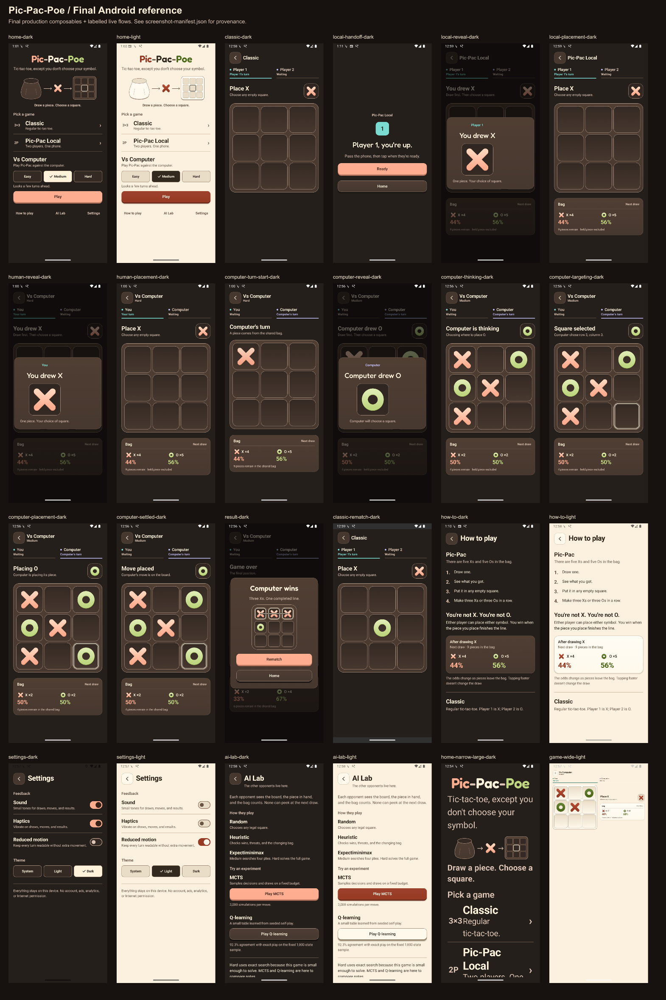
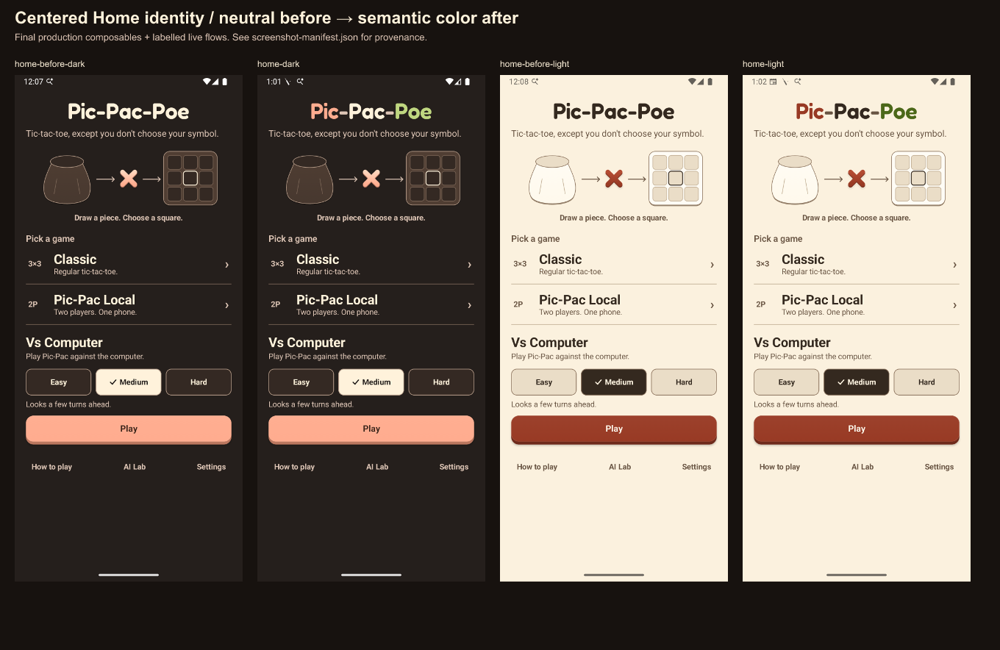

# Pic-Pac-Poe: authoritative Android-to-iOS handoff

This package specifies the approved **Form Playground 2.0** Android release candidate for a later native Swift/SwiftUI implementation. It is a product contract, not a redesign brief. Read this document and every companion listed below completely before implementation. Keep the identified Android reference read-only. The Mac architecture pass must decide monorepo versus separate repositories, KMP versus independently verified native cores, before scaffolding production iOS code.

**Current delivery status:** Android runtime implementation and its recorded automated/emulator verification are complete. Version code 5 / name 2.0.0 is valid because the owner confirmed 4 is the highest uploaded Play code. Historical releases used local Windows signing and manual Play upload; GitHub signing automation is optional and does not block 2.0.0. A Play **upload-key-only** reset is pending, so no final signed AAB, upload, merged release SHA or tag is claimed. [Release identity](release-identity.json) separates the verified runtime candidate from deliberately unresolved release fields.

## 1. Release identity and authority

| Field | Value / authority |
| --- | --- |
| Product | Pic-Pac-Poe; exact Home wordmark `Pic-Pac-Poe` |
| Android application ID | `com.thevaguebox.probabilistictictactoe` |
| Candidate version | **2.0.0 / versionCode 5**; [build configuration](../../app/build.gradle.kts) is authoritative |
| Compile / target / minimum SDK | 36 / 36 / 24 |
| Canonical repository | `https://github.com/saipranithb/pic-pac-poe` |
| Historical configured remote | `https://github.com/saipranithb/PicPacPoe.git` redirects to the canonical repository |
| Release commit / annotated tag | Read [release-identity.json](release-identity.json); null means unverified/blocked, never an implicit latest-HEAD reference |
| Release and human-check evidence | [RELEASE_VERIFICATION.md](RELEASE_VERIFICATION.md) |
| Mac starting instructions | [MAC_CODEX_BOOTSTRAP_PROMPT.md](MAC_CODEX_BOOTSTRAP_PROMPT.md) |

The code was developed on `codex/pic-pac-poe-remaster`. Relevant preserved history: `4e8cf00` modular rules/AI/Compose rebuild; `73b2ed2` AI Lab/hardening; `004c17f` AGP compatibility; `2de4d53` serialized computer-turn fix; `4f76dcf` 2.0.0 production foundation; `2f79fb5` Form Playground implementation; `e7a857e` UI regression tests; `c71be19` design handoff; `3ace864` Fredoka typography/entrance. The final centering/semantic-color refinement and integration identity are recorded in the identity file after their actual commits exist. Nothing in this package authorizes history rewriting.

**Source precedence:** identified release Kotlin implementation and executable tests → platform-neutral contracts/JSON → screenshots as rendering evidence → older design proposals. Report a discrepancy instead of quietly selecting the easier behavior. The release tag points to immutable Android release source. A later documentation-only commit may record that tag's SHA; it does not retroactively change the tagged app. Follow the explicit identity relationship instead of expecting a commit to contain its own hash.

From a clean macOS clone:

```sh
git fetch origin --tags
python3 docs/ios-handoff/verify-handoff.py
# Use the exact non-null identity values, never a guessed tag:
git rev-parse '<recorded-tag>^{commit}'
git show --no-patch '<recorded-release-commit>'
git status --short
```

The resolved tag commit must equal `git.releaseCommit`. Strict release validation is `python3 docs/ios-handoff/verify-handoff.py --strict-release`; it deliberately fails while release identity is blocked. No Android build is needed to inspect the documents, images, fonts, JSON or hashes. Android build verification additionally requires the documented JDK/SDK/Gradle toolchain.

### Required reading map

| Contract | Required contents |
| --- | --- |
| [BEHAVIOR_AND_STATE.md](BEHAVIOR_AND_STATE.md) | Full rules, worked examples, formulas, all AI algorithms, transition table, saved-state keys, stale-work guards, edge cases |
| [DESIGN_AND_MOTION.md](DESIGN_AND_MOTION.md) | Exact palette/type/geometry/layer order, control states, wordmark, every animation and feedback event, responsive/accessibility rules |
| [ANDROID_TO_SWIFTUI_MAP.md](ANDROID_TO_SWIFTUI_MAP.md) | File/type responsibilities, data flow, concurrency, native counterparts and core-sharing decision inputs |
| [SCREENS_AND_ACCESSIBILITY.md](SCREENS_AND_ACCESSIBILITY.md) | Complete screen/state inventory, hierarchy, behavior, semantics, responsive and parity criteria |
| [IOS_PARITY_CHECKLIST.md](IOS_PARITY_CHECKLIST.md) | Android-to-XCTest evidence matrix, 14 ordered milestones and acceptance gates |
| [golden-fixtures.json](golden-fixtures.json) | Portable rule, probability, deterministic draw, AI-choice, terminal-move, handoff and restoration fixtures |
| [design-tokens.json](design-tokens.json) | Exact platform-neutral colors/RGBA/type/space/shapes/geometry |
| [motion-spec.json](motion-spec.json) | Triggers, owners, timing/easing, normal/reduced variants and feedback |
| [state-machine.json](state-machine.json) | Machine-readable states, events, guards, timing and restoration |
| [ASSET_MANIFEST.md](ASSET_MANIFEST.md) | Portable asset locations, licenses, screenshot provenance, checksums and regeneration |
| [PRIVACY_AND_STORE.md](PRIVACY_AND_STORE.md) | Manifest/dependency/data-flow audit, store posture, account-deletion conclusion and planned legal URLs |
| [REPOSITORY_AND_DELIVERY.md](REPOSITORY_AND_DELIVERY.md) | Modules/toolchain/tests/workflows/manual signing gate and four-way Mac architecture decision input |
| [Release verification](RELEASE_VERIFICATION.md) | Actual executed results, limitations, artifact provenance, signing/Play gate, owner checklist |

JSON source paths are relative to repository root unless their schema explicitly states otherwise. Markdown paths are relative to the document. Asset manifest paths are relative to this directory; screenshot manifest paths are relative to `reference/`. Do not use workstation paths or chat attachments as prerequisites.

### Canonical and archival boundary

This directory is the single portable Android-to-iOS handoff. [`docs/form-playground-2.md`](../form-playground-2.md) and [`docs/BRAND_TYPOGRAPHY_HANDOFF.md`](../BRAND_TYPOGRAPHY_HANDOFF.md) are implementation-era evidence for the same production system, not competing iOS specifications. [`PIC_PAC_POE_REMASTER_PLAN.md`](../../PIC_PAC_POE_REMASTER_PLAN.md), `docs/screenshots/humanized/`, `docs/screenshots/turn-flow/` and `reference/home-before-*` describe earlier audits, designs or before-states and are **archival**, not parity targets. When any archival material conflicts with current Kotlin source, executable tests or this package, the current source/contracts win and the discrepancy must be reported.

## 2. Product intent and personality

Pic-Pac-Poe is an offline three-by-three game about decisions under uncertainty. Classic mode is familiar fixed-symbol tic-tac-toe. Pic-Pac draws a symbol before each move from one shared finite bag: **you are a player, not an X or an O**. Either player can complete either symbol's line and win. Drawing before choosing a cell changes both immediate tactics and future probabilities. The public bag counts are strategic information, not decoration or a cosmetic randomizer.

Form Playground 2.0 feels like a small, well-made tabletop object: cocoa/cream setting, coral X and pistachio O, front-facing chunky pieces, shallow sidewalls, recessed fixed wells, modest contact shadows and immediate pressed states. It is playful through shape, tactility and concise emotional copy, not through noise. Actor identity, held piece, legal input, computer target and remaining odds must always outrank material detail.

“Playful but mature” typography means **Fredoka SemiBold for the centered identity and result titles; Fredoka Medium selectively for reveal/handoff moments; system sans for every functional label, instruction, setting and probability**. No all-rounded display-font interface. Brand-defining elements are the exact identity, warm semantic palette, player/symbol separation, stable board, readable sequential computer turn and finite responsive motion.

Explicit anti-goals: generic AI gradients, glass-card soup, decorative blobs, promotional badges, excessive pills, gratuitous 3D, neon, shimmer, glow, rainbow letters, title extrusion, unrelated looping idle motion, online accounts/ads/analytics/cloud AI. The Home bag→symbol→board illustration has one approved, visibility-scoped X/O alternation described below; it is not permission to animate other idle surfaces. Existing tiny directional piece/surface gradients are material shading, not a gradient branding system.

## 3. Complete game rules

The detailed normative specification, exhaustive invariants and worked examples are in [Behavior and state](BEHAVIOR_AND_STATE.md). Essential distinctions:

- **Classic:** Player 1 owns X, Player 2 owns O, even if Player 2 starts a rematch. Empty-cell placement only. Completing a line wins; a full board without a line draws.
- **Pic-Pac Local:** shared initial bag has **5 X + 5 O**. Handoff hides board/bag and their accessibility subtree until Ready. Draw/remove one symbol, show it, then let the current actor choose an empty cell. No permanent symbol ownership.
- **Vs Computer:** same Pic-Pac rules; human is Player 1/You, computer Player 2/Computer. All agents see only lawful public observation. Presentation is serialized even if search finishes immediately.
- A move that completes a line wins for the **actor who placed it**, regardless of which actors placed earlier matching pieces. Check win before full-board draw. Multiple completed lines remain legitimate. Terminal play cannot continue.
- The bag removes at **draw**, not placement. If hidden counts are `x,o`, next-draw probabilities are `x/(x+o)` and `o/(x+o)`; the currently held piece is excluded. After an initial X draw, counts are 4/5 and next odds are 4/9 and 5/9. The ten-piece bag exceeds nine board cells intentionally; an unfinished hidden remainder is normal.
- Revision and turn token reject stale/duplicate/occupied/terminal actions without consuming another draw. The starting-player/rematch rules are explicit in the supplement: a rematch alternates starter; launching another mode/Home does not automatically reset the remembered next starter.

Do not “simplify” probabilities to independent 50/50 draws or alternate symbols automatically. Independent graph enumeration currently yields 11,065 chance states, 21,314 decision states, 6,648 terminal states, 39,027 total canonical states under the documented phase-aware keys.

## 4. AI contract

Read the algorithm-by-algorithm formulas, tie-breaking, RNG, policy binary format, oracle values and source/test mapping in [Behavior and state](BEHAVIOR_AND_STATE.md). Production Easy is **HeuristicAgent**, not RandomAgent. Medium is expectiminimax with depth 4; Hard is full exact expected-value search. Random exists as a lawful baseline/tool agent. MCTS uses the stochastic model, its own RNG and 2,000 simulations in the app (class default: 1,000). Q-learning is a bundled offline-trained versioned table, not online learning or a network model.

AI is given board, current actor, held symbol and hidden counts, never the live session RNG, future draw queue or production seed. Search chance branches use remaining-count probabilities. Preserve utility perspective and chance/decision alternation. At the first decision, the exact oracle gives center `5/21` and other cells `11/126`; both possible first held symbols choose center. Reproduce algorithm behavior and deterministic fixtures, not Kotlin syntax or an assumed cross-language PRNG sequence.

Search runs off the UI thread. Hard has no explicit production time/node deadline and warm caches affect latency, not semantics. The iOS coordinator must tolerate late results with a truthful THINKING stage; it must not fake a result to satisfy an animation duration. MCTS budgets are simulations, not milliseconds. Training stays outside the app. Cancel cooperatively and still reject stale delivered results by identity.

## 5. Architecture and data flow

The four modules are pure-ish JVM `game-core` rules/session/model; `game-ai` lawful agents/search/policy; `game-tools` offline training/evaluation/enumeration; Android `app` presentation/settings/feedback. See the comprehensive [source-to-native mapping](ANDROID_TO_SWIFTUI_MAP.md).

```text
UI command → main-thread coordinator → domain session/rules → immutable UI snapshot
                           ↘ public observation → AI worker → guarded result ↗
Visible stage clock ─────────────── guarded acknowledgement ────────────────↗
Settings store → theme / reduced-motion / feedback policy → native views
Restoration snapshot ↔ coordinator (never reconstruct by replaying a draw)
```

`GameViewModel` owns domain session, revision/token/presentation identities, pending AI result and UI projection. Composables own layout and decorative transforms; `PresentationClock` owns only stage delay acknowledgements. AI calculation begins during computer REVEALING. Settings are local DataStore; navigation is screen state, not a server/router. Dependencies do not allow an agent to access the private environment RNG.

The portable implementation shape is pure value rules, a main-actor observable coordinator, separately isolated cancellable AI tasks, injected clock/RNG, validated Codable restoration and native preferences. Do not assume `Task {}` moves expensive work off the main actor. Repository/core sharing is not decided here: [Repository and delivery](REPOSITORY_AND_DELIVERY.md) compares one monorepo, separate repositories, KMP and duplicated native cores governed by fixtures. KMP is **not presently required as a prerequisite** because Java RNG/I/O and Android lifecycle remain platform-bound, but the Mac architecture pass owns the final decision.

## 6. Full state machine and clock ownership


Editable [Mermaid source](state-machine.mmd), complete [transition/guard/restoration tables](BEHAVIOR_AND_STATE.md) and [JSON](state-machine.json) are normative together. The main path is:

```text
Computer TURN_START → REVEALING → [AI_THINKING if late] → AI_TARGETING
  → AI_PLACING (domain move already committed) → AI_SETTLING
  → TERMINAL or next human TURN_START → REVEALING → PLAYING
Local HANDOFF → Ready → REVEALING → PLAYING → next HANDOFF/result
Classic PLAYING → legal move → PLAYING/result
```

All human cell input is locked outside legal human PLAYING. Early AI completion waits for the reveal acknowledgement; late completion enters AI_THINKING. AI_TARGETING exposes the chosen empty cell before mutation. Domain actor changes at commit, but displayed actor remains **Computer through AI_PLACING and AI_SETTLING**, including terminal moves. Result waits for settlement; no human reveal after a computer win/draw.

`presentationId` guards a particular visible beat. Revision guards the game generation; turn token guards the domain turn. They are not interchangeable. Every async callback rechecks current identities/stage; cancellation alone is not sufficient. The target and selected symbol survive targeting/placing/settling restoration; board commit happens once. Full current-stage delay restarts on composition recreation, not elapsed-time continuation. Reduced Motion retains readable essential delays and removes decoration. Exact normal/reduced timing tables are in the JSON and motion supplement; animation completion is never the commit authority.

## 7. Screen and flow inventory

The [screen specification](SCREENS_AND_ACCESSIBILITY.md) records intent, information, hierarchy, interactions, semantics, adaptation, source and parity acceptance for Home/setup, Classic/game/result/rematch, Local handoff/reveal/placement, every human/computer stage, How to Play, Settings and AI Lab. Each important state has a stable reference identifier. Use [screenshot-manifest.json](reference/screenshot-manifest.json) for the actual filenames/provenance, not an implied runtime capture.



Live-flow images prove UI-driven integration; fixture images render actual production composables at controlled states and prove appearance/semantics, **not live AI timing**. Both are useful and labeled separately. Pressed, focused, selected and disabled behavior are specified and tested where noted; a static image cannot certify transient interaction or spoken announcements. Dark/light, normal/reduced, narrow/large-text/wide references are curated rather than hundreds of duplicate captures.

## 8. Exact design system

Read [DESIGN_AND_MOTION.md](DESIGN_AND_MOTION.md) and [design-tokens.json](design-tokens.json) for every implemented value. Summary anchors: 20 dp screen gutter; spacing of 4/8/12/16/24/32 dp; choice/control/surface/board radii of 10/14/18/24 dp; control minimum of 48 dp; board inset of 12 dp and gap of 6 dp; nine fixed, equal square cells. For board side `B`, cell side is `(B-24-12)/3`. Custom X/O paths, face/edge/shadow layers and focus outlines share hit geometry; no perspective or moving targets.

Dark canvas is `#251F1C`, light `#FBF1DE`; symbol colors are dark coral `#FFAC8F` and pistachio `#BFD680`, light coral `#983A24` and pistachio `#4C6819`. Player 1's teal and Player 2's lavender are independent of symbols. Functional text uses platform sans; exact role weights/sizes/line heights/tracking are enumerated in the supplement. Native iOS points, SF metrics, safe areas and platform-rendered elevation may adapt, with visual comparison; gameplay geometry, semantic role distinctions and accessibility must remain.

Android's generic 2 dp elevation shadow has **no app-defined blur/offset/opacity**. Do not fabricate precise shadow numbers. Explicit custom unblurred contact-shadow paths do have exact offsets/alpha in the contract. Dynamic wallpaper colors are not used. Subtle decorative rims are not meaningful-state contrast signals.

## 9. Final wordmark



Use unchanged bundled **Fredoka 2.001 SemiBold (600)** at 40 sp nominal size, 46 sp line height and −0.35 sp tracking, with no extra Android font padding, centered within its full available width. Visual runs are `Pic`, `-`, `Pac`, `-`, `Poe`; color roles are `x`, `textSecondary`, `text`, `textSecondary`, `o`. Pac is cream `#FFF2DB` in dark mode and cocoa `#34291F` in light mode; hyphens use muted neutral `#DDC5B5`/`#695543`. All four roles exceed 4.5:1 against their Home canvas (minimum: 5.676:1). The existing palette is unchanged.

Only the identity width-fits when required: measure the real five run widths, preserve a one-line exact title with a 2 dp total safety allowance, binary-search size for narrow/large-text layouts, and scale its line height proportionally. Do not shrink functional text, ellipsize the name or change the subtitle/layout below. Internally LTR even in RTL UI; expose exactly one heading `Pic-Pac-Poe`, not five separately announced fragments.

Three animation groups are `[Pic]`, `[-Pac]`, `[-Poe]`; delays are 0/70/140 ms, with 480 ms per group and 620 ms total. Progress moves from 0 to 1.015 at 360 ms, then to 1 at 480 ms, with the exact documented cubic easings; offset is 8 dp, scale is 0.95 → 1, initial rotations are −0.8/+0.6/−0.6 degrees (hyphens unrotated), and opacity is clamped. This is a bounded keyframe settle, **not a physical spring** with unspecified stiffness. Consume once at entrance start, wait for stored motion preference, never replay on return/recreation. Reduced Motion is final immediately and can stop an in-flight entrance. Full formulas and SwiftUI guidance are in the design/motion companion. Fonts/license remain at their original repository paths; see [asset manifest](ASSET_MANIFEST.md).

## 10. Motion, haptics and sound

The [motion JSON](motion-spec.json) inventories finite animations and the sole approved repeating Home illustration, with owners, triggers, durations and reduced variants. It distinguishes essential presentation clocks from decoration and records feedback events. Board geometry does not animate.

Home's central illustration alternates the production X/coral and O/pistachio pieces every 1400 ms in a fixed 44 dp box (2800 ms cycle). One restrained1→1.035→1 pulse occurs at 200/340/520 ms of each half; the last 280 ms crossfade outgoing1→0/incoming0→1 with scale 1→.97/.97→1. Reduced Motion removes all scaling and uses a 400 ms opacity-only transition at the same cadence; system animations-off uses instant1400 ms swaps. Bag, arrows, miniature board and surrounding layout remain stationary. Start from X on restart, only after settings load and while visible/RESUMED; cancel offscreen/inactive/disposed. This visual loop uses no RNG and changes no navigation, saved state, AI or turn presentation. It emits no sound/haptics. See [full motion contract](DESIGN_AND_MOTION.md).

Android haptic constants/ToneGenerator tones are implementation details, not files to extract or literal iOS waveforms. Preserve event meaning/settings, use restrained native haptics/audio, and tune on real devices. WIN/DRAW feedback for a computer move currently occurs at domain commit into AI_PLACING, not when its result dialog appears. Do not silently shift the game sequencing to sync sound. Human haptic quality and sound balance remain unchecked.

## 11. Accessibility

Full semantics/reading order/announcements are in [Screens and accessibility](SCREENS_AND_ACCESSIBILITY.md). One Home heading; one stable illustration description, “A random X or O is drawn from the bag, then placed on the board.”, with no repeated symbol announcements; explicit row/column/mark board descriptions; distinct “Computer selected…” and “Computer placed…” states; selected controls expose state; settings rows expose one switch each; hidden handoff removes private content. Actor text/shape/checks/focus borders supplement color. Functional target sizes are at least 48 dp in the Android contract; preserve generous native targets, not merely minimum visible artwork.

Automation covers semantics, disabled gates, grouped identity, token contrast, no-clipping and large-text reachability. It is **not human TalkBack or VoiceOver certification**. Require physical reading/focus order, announcement timing, modal focus/return, touch exploration and switch state checks. iOS must honor system Reduce Motion in addition to the app preference; Android currently uses its stored preference for custom motion. Match Dynamic Type intent and scrollability, not Android font-scale numbers mechanically.

## 12. Persistence and lifecycle

Settings: sound=true, haptics=true, reducedMotion=false, theme=SYSTEM by default. Persist locally. The comprehensive saved-state key table and restoration matrix in [Behavior and state](BEHAVIOR_AND_STATE.md) cover screen/mode/difficulty/stage/presentation ID, revision/next starter, board/active/starter/token, bag counts/held phase, outcome and AI target/symbol.

SavedStateHandle is instance/process restoration support, **not a durable match-history database**. Home clears the match. Restore snapshots directly; never replay a random draw or committed move. Elapsed stage milliseconds, solver caches, jobs, pending early decision and transient feedback are not persisted. Rotation retaining a ViewModel differs from reconstructing one from saved state; test both. Current Android has no explicit scene-phase presentation pause guarantee. Native iOS should make scene handling explicit while preserving the same held piece/commit/input gates.

## 13. Tests and parity matrix

[IOS_PARITY_CHECKLIST.md](IOS_PARITY_CHECKLIST.md) maps every Android suite to XCTest/XCUITest invariants, including probability conservation, all wins/illegal moves, exact oracle/complete graph, AI fairness/ties/randomness, state-machine early/late/stale/cancelled results, targeting/terminal restoration, UI flows, accessible controls, reduced motion, both themes, narrow/wide and large text. [`golden-fixtures.json`](golden-fixtures.json) supplies common, platform-neutral inputs/expected results so both implementations can execute the same cases independently. Named source tests are evidence of intent; only [RELEASE_VERIFICATION.md](RELEASE_VERIFICATION.md) states which were actually executed and their results.

Keep deterministic unit/coordinator tests independent of visual tests; use injected clocks and scripted randomness. Live Easy/Medium/Hard flows test the actual worker/coordinator and input release after settlement. Fixture capture is not a substitute. Cross-language randomness equality needs a shared specified RNG or scripted draws; a numeric Kotlin seed alone is not a Swift specification.

## 14. Privacy, local data and store posture

The source-backed conclusion is local-only: no Internet or advertising-ID permission; no accounts, ads, analytics, crash SDK, tracker, external storage, background service, networking client or personal-data transmission. Settings and restoration remain local, and Android backup/device transfer are disabled. The merged manifest's AndroidX startup provider and profile receiver are framework mechanics, not product data collection. See the complete evidence and intended Android Data Safety/iOS App Privacy posture in [Privacy and store](PRIVACY_AND_STORE.md).

No account-deletion function is necessary while account creation and server-side account data do not exist. The proposed privacy and terms URLs are **planned and not verified live**; the owner must validate them before store submission. These are engineering conclusions, not legal guarantees, and must be rechecked against the final artifacts/dependencies.

## 15. Known limitations and deliberate compromises

- Physical-device frame pacing, haptic feel, sound balance, TalkBack and install/update remain owner gates; emulator results cannot certify them.
- Hard has no explicit app search deadline; MCTS simulation count is not a latency SLA. Keep expensive work off main actor and retain THINKING.
- Generic Android elevation shadows/system font metrics are platform-dependent; native optical alignment requires comparison rather than pixel-offset hacks.
- At a narrow 320 dp width with large text, difficulty labels can wrap awkwardly (including Medium); actions remain reachable. Do not label this a new wordmark regression or silently broaden this release into a layout redesign.
- Saved-state malformed enum/target cases and background handling have limitations detailed in the behavior supplement. Normal valid-state restoration is covered; arbitrary corrupted state is not claimed robust.
- A retained ViewModel's last transient feedback may replay on a new composition after recreation; process-restored snapshots omit effects. Native iOS should model consumable ephemeral feedback explicitly.
- Android does not independently bind its custom motion preference to system Reduce Motion. Native platform adaptation should honor iOS accessibility conventions without skipping essential explanation.
- No iOS code, online play, cloud services, new monetization, KMP conversion, analytics, extra experimental algorithms or visual redesign is part of this handoff.
- Play App Signing is enabled and code 4 is the confirmed global maximum. The pending upload-key reset/activation and exact release-commit approval are release gates, not reasons to substitute a debug key, alter the Google-held app-signing key, guess a tag, or use GitHub automation as a workaround.

## 16. Recommended native implementation plan

Use the detailed acceptance criteria and test mapping in [IOS_PARITY_CHECKLIST.md](IOS_PARITY_CHECKLIST.md), in this order:

1. Verify the exact Android reference/assets/toolchain, decide repository/core-sharing architecture on the Mac, and agree minimum iOS before scaffolding.
2. Implement the chosen native/shared core boundary and execute the platform-neutral golden fixtures plus exhaustive invariant/oracle tests.
3. Implement main-actor coordinator, identity guards, fake presentation clock and restoration tests.
4. Build semantic tokens and exact licensed Fredoka policy; validate contrast and Dynamic Type.
5. Draw board/wells/pieces natively with fixed hit geometry and accessible cell descriptions.
6. Implement Home/navigation/finite wordmark and persisted settings gate.
7. Complete Classic win/draw/rematch/starter/restoration flow.
8. Complete Local privacy handoff/draw/reveal/placement and bag odds.
9. Implement lawful AI algorithms and all early/late/target/place/settle/terminal flows.
10. Implement Settings, How to Play and explicitly experimental AI Lab.
11. Add bounded motion and native haptic/sound equivalents with settings/reduced behavior.
12. Verify VoiceOver, native focus, large text, color-independent state and touch targets.
13. Capture dark/light/narrow/wide/accessibility states and compare against this package; explain native differences.
14. Profile physical iPhone behavior, verify signing/install/update/privacy and stop at internal distribution for human review.

Each milestone ends with tests, visual evidence where relevant and a coherent native commit. Do not import screenshots as controls or start by recreating a single polished Home while the rules/state machine remain implicit. The release candidate's behavioral clarity is the product; its tactile visual system supports that clarity.
